# 쿼리 최적화의 필요성

앞서서 프로젝트에 Redis 캐시를 적용하여, 조회 성능을 빠르게 만들고 DB의 부하를 덜어줄 수 있도록 구현하였다. 그렇다면, Redis와 같은 추가적인 기술을 사용하지 않고 DB 성능을 최적화하기 위해서는 어떻게 해야할까?

현재 프로젝트에서 사용중인 MySQL을 비롯하여, 다른 RDBMS와 심지어는 MongoDB와 같은 NoSQL DB에서도 **인덱스** 라는 것을 사용할 수 있도록 제공하고 있다. 조회가 빈번하게 발생하는 필드 조건에 적절하게 인덱스를 활용하면, 인덱스 없이 풀스캔 방식으로 조회할 때보다 훨씬 효율적인 비용으로 더 빠르게 결과값을 조회해서 서버에 제공할 수 있게된다.

그러나, 무조건 인덱스를 추가한다고 하여서 장점만 존재하는것은 아니다. 무분별하게 인덱스를 추가할 경우 저장 공간이 낭비되게되고 새로운 데이터가 추가될 경우 인덱스로 인한 재정렬 비용이 발생하는 등의 사이드 이펙트까지 고려하여서 신중하게 인덱스 추가를 결정하여야한다.

## 🔎 인덱싱, 어디에 해야할까?

우선, 기본적으로 PK에는 인덱싱이 적용되어 있기 때문에 PK가 아닌 다른 필드를 사용해서 조회하는 쿼리 중에서 조회가 빈번하게 발생할 수 있는 쿼리가 인덱싱의 대상이 될 수 있다.

- 인기 상품 조회

현재 e-커머스 로직에서는 '인기 상품 조회' 로직이 최적화의 대상이 될 수 있다. 현재 해당 쿼리는 대략 아래와 같은 형식으로 조회가 이루어진다

```SQL
SELECT * FROM h99plus.daily_popular_products
WHERE soldDate BETWEEN '2024-01-01' AND '2024-07-31'
ORDER BY totalSold DESC;
```

인덱스가 없는 현재 상태에서 위와 같은 쿼리가 실행되면 아래와 같은 과정으로 조회가 이루어질 것이다.

1. soldDate에 대한 인덱스가 없으므로, 테이블 row 전체에 대해서 풀스캔이 이루어진다.
   - 디스크에서 테이블의 모든 페이지 데이터를 순차적으로 읽음
2. 각 행에 대해서 `soldDate BETWEEN '2024-01-01' AND '2024-07-31'` 인 조건을 검사해서 필터링한다.
3. 조건에 맞는 모든 행을 메모리에 저장하고, 이 결과 집합이 너무 크면 디스크 기반 정렬을 수행한다.
4. totalSold를 기준으로 내림차순 정렬을 수행한다
5. 결과 반환

각 단계 하나하나를 되짚어 보았을때, 모든 단계가 비효율의 연속이라는것을 알아차릴 수 있을 것이다. 그렇다면, 얼마나 비효율이 발생하는지 알아보기 위해 다음 쿼리를 실행하여 실행 계획 결과를 통해 분석해보자.

```SQL
EXPLAIN ANALYZE
SELECT * FROM h99plus.daily_popular_products
WHERE soldDate BETWEEN '2024-01-01' AND '2024-07-31'
ORDER BY totalSold DESC;

-- 결과
-- '-> Sort: daily_popular_products.totalSold DESC  (cost=22179 rows=220105) (actual time=179..188 rows=220550 loops=1)\n    -> Filter: (daily_popular_products.soldDate between \'2000-01-01\' and \'2024-07-31\')  (cost=22179 rows=220105) (actual time=0.0613..101 rows=220550 loops=1)\n        -> Table scan on daily_popular_products  (cost=22179 rows=220105) (actual time=0.056..56.8 rows=220550 loops=1)\n'
'
```

위 실행 결과를 요약해보면

- 테이블 스캔 -> 필터링 -> 정렬순으로 전체 실행 계획이 진행되었다.
- 풀스캔 소요 시간: 59.8ms
- 정렬 소요 시간: 7ms
- 전체 실행 시간: 125ms

위 실행계획 결과로부터 필터링과 풀스캔에 정말 많은 시간이 소요된 것을 확인할 수 있었다.

그렇다면 이 결과로부터 `daily_popular_products` 테이블에 인덱스를 추가해야하는 근거는 무엇인지 알아보자.

1. soldDate 범위를 B-tree 기반으로 빠르게 조회한다. 풀스캔 대신 인덱스 스캔을 사용하기 때문에 I/O 비용이 크게 감소한다.
2. totalSold에 대한 내림차순 정렬을 인덱스에 포함시킬 경우, 별도의 정렬 과정이 필요없어진다.
3. 하루에 한 상품 옵션에 대해 한 row만 생성되기 때문에, 새로운 데이터 추가로 인한 재정렬 비용이 크지 않다. 또한 totalSold가 변경되어지더라도, 특정 날짜 안에서만 재정렬이 발생하기 때문에 재정렬 비용이 상대적으로 크지 않다.
4. 인덱스는 테이블 데이터보다 크기가 작기 때문에, 메모리에 더 많은 부분을 캐싱할 수 있다.
5. 만약 soldDate와 totalSold만을 요구하는 통계용 쿼리가 있을때는 테이블 접근 없이, 인덱스만으로 쿼리 처리가 가능해진다(커버링 인덱스)

그렇다면, 어떤 키를 인덱스로 설정해야할까?

아마도 인기상품조회 쿼리를 위해서는 복합키를 사용하는것이 가장 효율적일 것이다. 조회의 조건인 soldDate는 인덱싱을 해야하는것이 자명하고, 인기상품을 조회하는것이기 때문에 판매량이 가장 높은 순으로 정렬해서 반환하기 위해서 totalSold를 내림차순으로 정렬되어지도록 인덱싱을 한다.

복합키에서는 순서도 중요한데, 이 복합키에서는 soldDate를 앞에, totalSold를 뒤 순서에 배치하여 생성할 것이다. 일반적으로 인덱스를 지정할때는 카디널리티가 높은 값을 앞 순서에 두어야한다. 그러나 이번 경우에는 조회에 사용되는 조건이 soldDate이며, 이 순서로 인덱스를 생성할 경우 soldDate 내의 totalSold의 카디널리티가 중요해지기 때문에 '각 날짜별 판매량이 높은 순으로 정렬' 한다는 쿼리의 패턴에 가장 적합하다고 판단하였다.

이 근거를 바탕으로 인덱스를 아래와 같은 명령어를 사용하여 추가하였다.

```SQL
CREATE INDEX idx_soldDate_totalSold ON daily_popular_products (soldDate, totalSold DESC);
```

그리고 다시 동일하게 실행 계획을 호출해보면 어떻게 될까? 결과는 아래와 같다.

```SQL
-- 결과
-- '-> Sort: daily_popular_products.totalSold DESC  (cost=6694 rows=14874) (actual time=36.8..37.5 rows=8265 loops=1)\n    -> Index range scan on daily_popular_products using idx_soldDate_totalSold over (\'2024-07-01 00:00:00\' <= soldDate <= \'2024-07-31 00:00:00\'), with index condition: (daily_popular_products.soldDate between \'2024-07-01\' and \'2024-07-31\')  (cost=6694 rows=14874) (actual time=0.118..30.8 rows=8265 loops=1)\n'
```

위 실행 결과를 요약해보면

- 인덱스 범위 스캔 -> 정렬순으로 전체 실행 계획이 진행되었다.
- 풀스캔 대신 인덱스 스캔을 사용하여 빠르게 조회하였다.
- 정렬 소요 시간: 0.7ms
- 전체 실행 시간: 37.5ms

인덱스를 사용하기전인 125ms보다 약 70% 가량 개선된 37.5ms가 걸렸다. 이와 같이 최적화하여, 앞으로 더 시간이 흐르고 많은 상품이 추가되어 테이블에 row가 현재보다도 더 방대하게 쌓이더라도 인기 상품 조회를 빠르게 할 수 있을 것으로 기대해볼 수 있다.

# 트랜잭션 최적화

현재 프로젝트에서 최적화를 위해 캐싱과 인덱싱을 추가하였다. 여기에서 더 최적화를 하기 위한 방법으로는 트랜잭션을 최적화하는 방법이 있다.

## 이벤트 기반 아키텍처를 통한 트랜잭션 최적화

트랜잭션 최적화의 핵심 전략 중 하나는 이벤트 기반 아키텍처를 활용하여 핵심 비즈니스 로직과 부가적인 작업을 분리하는 것이다. 이 방법을 통해 다음과 같은 이점을 얻을 수 있다:

1. 트랜잭션 시간 단축: 핵심 비즈니스 로직만 트랜잭션 내에서 처리하고, 외부 API 호출이나 시간이 오래 걸리는 작업은 비동기적으로 처리함으로써 전체 트랜잭션 시간을 줄일 수 있다.
2. 시스템 응답성 향상: 사용자에게 중요한 결과를 빠르게 반환하고, 부가적인 작업은 백그라운드에서 처리함으로써 시스템의 전반적인 응답성을 개선할 수 있다.
3. 확장성 개선: 이벤트 기반 아키텍처를 통해 시스템 컴포넌트 간의 결합도를 낮추고, 각 기능을 독립적으로 확장할 수 있다.
4. 장애 격리: 외부 서비스나 API의 장애가 핵심 비즈니스 로직 실행에 직접적인 영향을 미치지 않도록 할 수 있다.

## 현재 e커머스 프로젝트가 MSA로 분리한다면..?

간단한 로직으로 구현되어있는 현재 프로젝트가 만약 MSA로 분리된다면 다음과 같이 각각의 서비스로 분리해 볼 수 있을 것 같다.

1. 사용자
2. 상품
   - 인기 상품
3. 주문
   - 장바구니
4. 결제

이 중에서 현재 구현에서 특히나 다른 모듈(서비스)와 많은 의존성을 가지고 있는 로직은 결제 완료 로직일 것이다. 현재 결제 로직은 대략적으로 다음과 같은 호출 흐름을 갖는다.

```
결제_확정_트랜잭션() {
  사용자_잔액_차감()
  인기_상품_판매량_누적()
  주문_상태_변경()
  결제_상태_변경()
  데이터_플랫폼_결제_정보_저장()
}
```

이 결제 확정 트랜잭션에서 핵심 로직과 부가적인 로직을 구분지어보면 다음과 같다.

핵심 로직

1. `사용자_잔액_차감()`
2. `주문_상태_변경()`
3. `결제_상태_변경()`

부가적인 로직

1. `인기_상품_판매량_누적()`
2. `데이터_플랫폼_결제_정보_저장()`

이렇게 분리한 핵심 로직과 부가적인 로직으로 트랜잭션을 재구성하면 다음과 같이 분리될 수 있다.

**결제**

```
결제_확정_트랜잭션(){
  사용자_잔액_차감()
  주문_상태_변경()
  결제_상태_변경()
  인기_상품_판매량_누적() // 이벤트 발행
  결제_완료_이벤트_발행() // 이벤트 발행
}
```

**상품**

```
인기_상품_판매량_누적_구독() {
  인기_상품_판매량_누적()
}
```

**데이터 분석**

```
결제_완료_이벤트_구독() {
  데이터_플랫폼_결제_정보_저장()
}
```

`사용자_잔액_차감()`과 `주문_상태_변경()`을 이벤트를 발행하지 않고 내부 로직으로 포함하여 설계한 이유는 응답의 **즉시성** 때문이다. 결제 프로세스에서 사용자 잔액 차감과 잔액 부족시로 인한 예외 발생은 즉시 처리되어야하는 중요한 작업이다. 따라서 성공시 잔액 차감을 즉시 확인하고, 실패시에는 롤백이 즉시 이루어질 수 있도록 하기 위해서 이와 같이 설계하였다.`사용자_잔액_차감()` 로직과 `주문_상태_변경()`로직을 이벤트로 분리한 뒤, 해당 이벤트 내에서 로직이 실패했다면 다시 롤백시키는 이벤트를 발행하는 방식으로 설계해볼수도 있었겠지만, 사용자 잔액 차감이나 결제 이후 주문 상태의 변경이 바로 바뀌지 않는다면 사용자 경험상 매우 좋지 않을 것이라고 생각하여 이와 같은 설계를 배제하게 되었다.

마지막으로 `인기_상품_판매량_누적()`과 `데이터_플랫폼_결제_정보_저장()`의 경우에는 부가적인 로직에 해당한다. 이 두 로직은 결제를 한 사용자에게 즉시 응답으로써 반환되어야할 대상이 아니며, 실패를 하더라도 사용자 개개인에게 크리티컬한 영향을 주지 않기 때문에 이벤트로 발행하는것이 적절하다고 판단하였다.

이러한 설계를 통해 다음과 같은 장점을 얻을 수 있을 것이라고 기대하였다.

1. 부가적인 로직을 이벤트로 발행하여, 트랜잭션을 최적화할 수 있다.
2. 관심사가 다른 로직을 분리하여 처리하기 때문에, 결합도가 낮아진다.
3. 각각의 분리된 기능들에 대해서 독립적으로 확장할 수 있게 된다.

그러나 현재 프로젝트에서는 실제 msa와 같이 사용자, 주문 서버가 별도로 존재하지 않는 상태이고, 이 값은 앞서 기술하였던 내용과 같이 응답의 즉시성이 필요하기 때문에, 외부 데이터 플랫폼에 결제 정보를 저장하는 `데이터_플랫폼_결제_정보_저장()`와 `인기_상품_판매량_누적()` 로직에 대해서만 이벤트를 발행해 처리하는 방식으로 트랜잭션을 최적화하였다.

## 만약 발행한 이벤트 내에서 실패한다면?

현재 발행한 `데이터_플랫폼_결제_정보_저장()`과 `인기_상품_판매량_누적()` 이벤트 내에서 오류가 발생할 경우, 이는 비동기적으로 실행된 로직이기 때문에 실패시에 대한 처리를 적절히 해주지 않을 경우 추적하기가 매우 어려워진다. 이를 해결하기위해 다음과 같은 두 이벤트에 대해 다음과 같은 처리 로직을 추가하였다.

1. 일정 시간 간격을 두고 최대 3회까지 로직을 재시도하도록 구현
2. 최대 3회의 재시도에도 불구하고 최종적으로 실패시에는 해당 오류를 로그로 남기고, 에러에 대한 상황 인지를 빠르게 담당자에게 알리기 위해 슬랙 채널에 메시지를 보내는 **이벤트를 추가적으로 발행하도록 함**

슬랙 메시지를 보내는 기능을 담당하는 서비스를 직접 의존하지 않고, 이 또한 이벤트로 발행하도록 하여서 이벤트 내에서도 결합도를 제거하였다.

이러한 실패시에 대한 처리를 추가함으로써, 비동기 속에서 실패한 로직에 대한 추적이 가능해지고 대응 가능하도록 하였다.

# 캐싱의 필요성

데이터베이스의 인덱스를 추가하지 않고, 어떤 요청에 대해 성능을 끌어올릴 수 있는 방법이 무엇이 있을까? 서버 머신의 성능을 끌어올리는 것, 비즈니스 로직을 효율적으로 개선하는 것 등등 다양한 방법이 있겠지만 가장 저비용으로 고효율을 낼 수 있는 방법은 아마도 **캐싱(Caching)** 일 것이다. 캐싱을 위해서 이 프로젝트에서는 앞선 분산 락에서 사용하였던 Redis를 캐시 저장소로 사용하기로 하였다. 서버 애플리케이션 내의 메모리를 사용할수도 있겠지만, 다중화 되어있는 서버 인스턴스에서는 각 서버가 가지고 있는 내장 메모리의 캐시를 동기화 시키는것은 쉽지 않기 때문에, 서버 외부에 Redis를 두고 사용하는것이 적절하다고 판단하였다.

그렇다면 Redis는 일반적인 데이터베이스와 어떤 차이가 있을까? 우선 일반적인 데이터베이스와 다르게 Redis는 In-memory 데이터베이스 라고 부른다. 그리고 다음과 같은 특징을 갖는다.

- In-memory란 RAM과 같은 메모리에 위치한다는 의미이기 때문에, 물리적으로 CPU에 더 가까이 위치해 있다. 그렇기 때문에 일반적인 저장소에 비해 더 빠르게 요청을 처리할 수 있다.
- 또한 가장 많은 시간을 차지 하는 부분인 물리적 디스크 I/O가 발생하지 않으므로, 데이터 접근시 발생하는 대기 시간이 매우 짧아지게 된다.

이 외에는 부가적으로 key-value 기반으로 조회하기 때문에 조회의 시간 복잡도가 O(1)이라는 점, 다양한 자료구조를 지원한다는 점, In-memory db임에도 비동기적으로 데이터를 디스크에 저장해 영구 저장이 가능하다는 특징들이 존재한다.

그렇다면 모든 데이터를 캐싱해두면 항상 빠른 응답을 반환하는것이 가능하지 않을까? 싶은 생각이 들 수 있다. 그러나 무작정 모든 데이터를 캐싱해서는 안된다. 그 이유는 다음과 같다.

- Redis는 앞서 소개했던것처럼 In-memory 기반의 저장소이다. 일반적인 메모리의 경우에 저장공간이 매우 적다. 그렇기 때문에 많은 양의 데이터를 Redis에 저장하려고 할 경우, 메모리 공간이 빠르게 소진되어 성능 저하가 발생할 수 있으며 전체 서버의 장애로 이어질 수 있다.

- 또한, 시스템 장애로 이어지지 않더라도 Redis는 메모리가 한계에 다다를 경우 LRU 정책을 사용해 데이터를 삭제하는데, 이때 캐싱의 중요도가 높은 데이터가 삭제되면 예상치 못한 성능의 저하가 야기될 가능성이 존재한다.

이 외에도 동기화문제 등 캐싱을 적용하기 위해서는 다방면의 고민이 필요하며, 적절한 로직에 적절한 캐싱 정책을 사용하는것이 중요하다.

## 🔎 어디에 적용해야 할까?

먼저 우리 서비스에 어떤 api들이 존재하는지 살펴보자

사용자

- 특정 사용자 잔액 충전
- 특정 사용자 정보(잔액) 조회

상품

- 전체 상품 목록 조회
- 인기 상품 목록 조회
- 특정 상품 조회

주문

- 주문서 생성

결제

- 결제

장바구니

- 특정 사용자 장바구니에 상품 추가
- 특정 사용자 장바구니의 상품 삭제
- 특정 사용자 장바구니 상품 목록 조회

위와 같은 기능들이 존재하는 현재 e-커머스 프로젝트에서는 어떤 로직에 캐싱을 적용하는것이 적절할까? 다음과 같이 캐싱 대상과 그 근거를 작성해보았다.

1. 전체 상품 목록 조회
   - 한번에 많은 양의 데이터가 조회되기 때문에 캐싱해두었을 경우 효과적일 것이라고 생각하였다.
   - 캐시 동기화 시점은 새로운 상품이 빈번하게 추가된다면 일정 시간마다 새롭게 캐싱하는 방식이 적절하고, 그렇지 않다면, 새로운 상품이 추가되었을때 기존 캐싱 데이터를 eviction 하고 캐싱하는 방식이 적절할 것 같다. 이번 과제에서는 별도로 상품 추가 api가 존재하지 않기 때문에, 서버의 스케줄러를 사용해서 일정 시간마다 캐싱을 갱신하도록 구현하였다. 자주 상품 목록이 업데이트 되는 경우가 아니라면 서버의 리소스가 낭비될 수 있다는 단점이 있으나, 캐시가 비어있는 상태에서 사용자가 전체 상품 조회를 할 때 서버가 캐싱을 새롭게 갱신해둠으로써 사용자는 캐시 미스일 때 느린 응답을 반환받는 경험을 하지 않아도 된다는 장점이 있기 때문에 이와 같은 방식을 채택하였다.
2. 인기 상품 목록 조회
   - 인기 상품의 경우에는 날짜별 조회가 가능하도록 구현되어있다. 각 날짜별로 데이터를 캐싱해두면, 인기 상품 조회시 캐싱된 데이터를 조회함으로서 빠른 응답을 반환할 수 있을 것이라고 생각하였다.
   - 캐시 동기화 시점은 상품의 구매는 비교적 빈번하게 일어나고, 이에 따른 구매 수량의 업데이트도 함께 발생하기 때문에 구매가 일어날때마다 새로운 캐싱 데이터를 동기화하기 보다는 일정 시간 정책을 세워두고 동기화하는것이 적절할 것 같다.

## 캐싱 전 vs 캐싱 후

### 전체 상품 목록 조회

테스트를 위해 1000개의 mock 상품 데이터와 약 3800여개의 연관된 상품 옵션 데이터를 DB에 추가하였다.

- 캐싱 전

  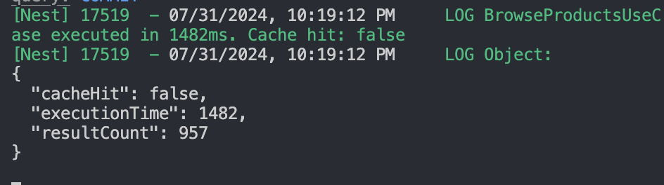

  캐싱 전에는 cacheHit가 실패했고, 총 실행 시간은 1482ms가 출력되었다. 반환 과정에서 조인이 발생하면서 생각보다 더 많은 조회 시간이 소요된 것 같다.

- 캐싱 후

  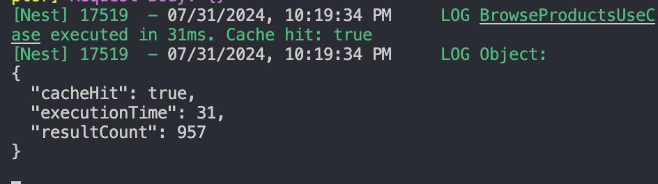

  캐싱 후에는 cacheHit가 성공했고, 총 실행 시간은 31ms가 출력되었다. 이미 한번 캐싱된 데이터를 반환함으로써, 데이터베이스 접근과 조인이 생략되어 확연히 빠른 실행 시간을 보였다.

### 인기 상품 조회

테스트를 위해 약 1000개 가량의 특정 날짜별 상품 옵션의 판매량 mock 데이터를 DB에 추가하였다. 본래 요구사항은 상위 5개의 날짜별 인기상품을 조회해오는 것이었지만, 조회 성능 차이를 확실하게 비교할 수 있도록 특정 날짜 기간 동안 상위 1000개의 상품을 조회해오도록 쿼리를 임시적으로 변경하여 테스트를 진행하였다. 그 결과는 아래와 같다.

- 캐싱 전

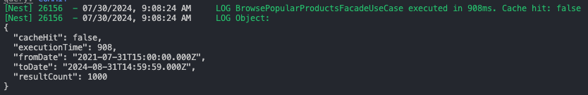

캐싱 전에는 cacheHit가 실패했고, 총 실행 시간은 908ms가 출력되었다. 데이터가 더 많아질 경우에는 실행시간이 점점 더 늘어날 것을 예상해볼 수 있다.

- 캐싱 후

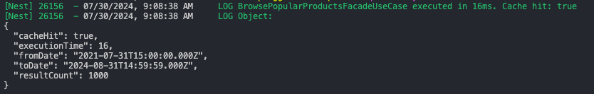

캐싱 후에는 cacheHit에 성공했고, 총 실행 시간이 16ms로 캐싱 전보다 확실히 빠르게 응답이 반환된 것을 확인해볼 수 있었다.

# 동시성 제어 방식에 대한 고찰

과제의 문서에서는 동시성을 제어해야하는 대상을 다음과 같이 언급하였다.

- 재고 감소
- 유저 잔액 차감

재고 감소의 경우에는 정확하게 사용자가 실제로 구매한 만큼만 차감이 이루어져야한다. 실제로는 100개가 팔렸는데 80개만 차감되어서 재고가 남아있는것으로 보여서는 안된다. 따라서 명백하게 모든 요청을 성공시키는 동시성 제어의 대상이 맞다고 생각한다.

유저 잔액 차감은 약간은 다른 방식의 동시성 제어가 필요하였다. 특정 한 사용자의 잔액을 차감시키는 것이기 때문에, 한번에 여러번의 잔액 차감 요청이 들어오는 상황은 일반적이지 않은 상황이다. 따라서 이러한 상황에서의 동시성 제어는 모든 동시 요청을 성공시키는것이 아닌, 최초 요청만 성공시키고 나머지 요청은 거절시키는 방식의 동시성 제어가 필요하였다. 이 부분에 대해서는 재시도를 수행하지 않는 낙관적 락 방식을 사용해서 구현하는것이 적절하다 판단하였다.

동시성 제어 고찰에 대한 자세한 내용은 재고 감소 로직을 바기반으로 작성하였다.

## 👕 재고 감소 동시성 제어

### 💡비관적 락 vs 낙관적 락

재고감소에 대해서 동시성 제어를 하기 위해서 초기에 비관적락을 적용하였다. 그 근거는 다음과 같다.

1. 평소에는 상품 재고 감소 로직에서 충돌이 많이 발생하지 않는다. 대부분의 경우에는 낙관적 락으로 구현해도 문제가 없으나, 타임세일과 같은 특수한 상황에서는 다량의 트랜잭션 충돌이 발생할 가능성이 존재하기 때문에 비관적 락을 사용하기로 결정하였다.
2. 충돌이 많이 발생하더라도 콘서트의 특정 좌석을 예매하는 상황 같은 요구사항이라면, 낙관적 락을 이용해 구현하는것도 괜찮다고 생각하였다. 왜냐하면 특정 한 자리에 대해서 충돌이 발생하였다는 것은 이미 그 자리는 예매가 완료되었다는 것이기 때문이다. 그러나 e커머스의 상품 재고 감소의 경우에는 특정한 옷 한 벌을 고르는 것이 아니라, 한 옵션에 해당하는 재고들 중 하나를 감소시키는 것이므로 재고가 남아있는 한 해당 옷 옵션에 들어온 요청에 대해서는 모두 처리를 성공시켜야 할 것 으로 생각하여 비관적 락을 선택하였다.

### 💡재고 감소에서 비관적 락 선택에 따른 장/단점과 성능 비교

#### 장점

- 타임 세일과 같이 트랜잭션 충돌이 많이 발생할 수 있는 환경에서 데이터 무결성을 안전하게 보장할 수 있다.
- 낙관적 락에 비해 고려해야할 부분들이 적어 구현이 상대적으로 간단하다.

#### 단점

- 트랜잭션이 데이터에 락을 잡고 있는 동안, 다른 트랜잭션은 대기해야하므로 전체 시스템 성능 저하 가능성이 존재한다.
- 데드락 가능성이 존재한다.

### 💡비관적 락 vs 낙관적 락 성능 측정

여기까지가 내가 직접 성능 측정을 하기 전까지 알고 있던 내용이다. 이 내용을 증명하기 위해서 비관적 락과 낙관적 락으로 각각 재고 감소 로직을 구현하여 성능을 측정해보았다.

#### 테스트 조건

1. 100개의 재고가 존재
2. 각 요청에서 사용자 100명이 동시에 1개의 재고 감소 요청을 보냄
3. 테스트 결과 0개의 재고가 남아야함
   이때 낙관적 락의 경우 재시도를 50번까지 시도하도록 하였다. (재고감소의 경우에는 어떻게든 성공을 시켜야하므로)

#### 테스트 결과

- 비관적 락

  

- 낙관적 락

  

아무리 재시도를 하더라도 그래도 락을 잡지 않는 낙관적 락이 처리 속도에서 우위에 있을 것이라고 생각하였다. 그러나 그 결과는 예상을 빗나갔다. 낙관적 락에서 여러번의 충돌이 발생하며 성공을 보장하기위해 재시도가 반복해서 발생하였고, 이에 따라 처리 속도가 2배~3배 가량 비관적 락보다 느려지는 경우가 발생하였다.

이 비교 테스트의 결과와 타임 세일과 같은 대량 트랜잭션 충돌 상황의 특수성을 고려하였을때, 더욱 더 재고감소 로직에 비관적 락을 사용하지 않을 이유가 없어보였다.

### 💡비관적 락이면 충분할까?

비관적 락을 사용하는것이 낙관적 락에 비해서는 더 나은 선택이라는 것이 명백해졌다. 그렇다면 이렇게 검증된 비관적 락이라면 그 어떤 상황에서도 만능일까?

이를 확인해보기 위해 테스트 조건에서 트래픽을 조금 더 추가해보았다.

#### 테스트 조건

1. 1000개의 재고가 존재
2. 각 요청에서 사용자 1000명이 동시에 1개의 재고 감소 요청을 보냄

   - 각 요청에서의 로직 처리 속도를 로깅함

3. 테스트 결과 0개의 재고가 남아야함

#### 테스트 결과

- 비관적 락

 

단 1000개의 동시 트래픽만 발생하더라도 비즈니스 로직내에서 각 쿼리 하나하나가 처리된 시간은 크게 차이가 없으나, 한 트랜잭션 전체 처리 시간은 크게 증가한것을 확인할 수 있었다. 이것은 어떤 것을 의미할까?

비관적 락의 특성상 한 트랜잭션씩 db락을 획득하게 되고, 해당 트랜잭션이 락을 해제하기 전까지 다른 트랜잭션들은 대기하게된다. 요청이 점점 늘어날수록 락 획득을 대기하는 트랜잭션은 점점 늘어나게 되고, db 커넥션 풀까지 고갈되며 전체 트랜잭션의 처리 속도가 느려지게 된다.

서비스에 100명 이하의 TPS만 발생한다는 보장이 없기 때문에 개선되어야할 부분이라고 생각한다. 이 부분은 어떻게 개선할 수 있을까? 현재 문제점을 다음과 같이 요약해볼 수 있다.

- 데이터베이스가 모든 락을 관리하고 있으며, 이 락은 트랜잭션이 시작된 후에 획득하기 때문에 한 트랜잭션이 과도하게 오래 유지되는 경우가 발생한다.

결국 이 문제를 해결하기 위해서는 락에 대한 관리를 DB가 아닌 다른 곳에서 담당하도록 해야한다. 그리고 락을 먼저 획득하고 트랜잭션을 실행하도록 해서 각 트랜잭션이 짧게 유지되어지도록 하고, 그러면서 동시에 scale out 되어있는 여러대의 서버 인스턴스에서도 락 관리가 잘 이루어져야한다.

### 💡Redis 기반의 분산 락 적용

#### Redis 기반의 분산 락을 선택한 이유

최종적으로 서버 인스턴스와 별개로 redis 서버를 배치하여, redis가 여러대의 분산된 서버 인스턴스의 락을 관리할 수 있도록 구현하였다. 그 근거는 다음과 같다.

- e커머스 프로젝트는 scale out된 서버 애플리케이션 환경을 가정한다.
- 비관적 락의 경우 요청이 많아질수록 트랜잭션을 시작한 상태에서 락을 대기하기 때문에, DB의 커넥션을 계속 차지하고 있게 된다. 이는 DB의 부하가 심해지는것을 의미하기 때문에, 이를 해소시켜줄 방법이 필요하다.
- Redis는 in-memory 기반으로 매우 빠른 요청 성능을 보여준다. 또한 싱글 스레드 기반이기 때문에 동시성 처리에 적합하다.

위와 같은 이유로 분산 락 방식을 선택하였고, 그 중에서도 Redis를 사용하여 분산 락을 구현하기로 결정하였다.

#### Spinlock vs Redlock vs Pub/Sub

**Spinlock**

- 이 방식은 단일 노드에서 가장 간단하게 구현할 수 있는 락 방식이다.
- CPU 자원을 계속해서 사용하며, 락이 해제될때 까지 무한하게 반복하며 락 획득을 대기한다.
- 장점
  - delay가 짧다 -> 빠르게 락 획득 가능
- 단점
  - CPU 집약적이기 때문에, 여러 스레드가 동시에 락 획득을 시도할 경우 심각한 성능 저하가 발생할 수 있다.
  - 일반적으로 단일 노드에서 작동하므로, 해당 단일 노드에 장애가 생겼을때 모든 락 메커니즘도 중단된다.

**Redlock**

- 분산 환경에서 신뢰할 수 있는 락을 제공하기 위해 설계된 알고리즘이다.
- 여러개의 Redis 인스턴스에서 과반수의 락을 획득하는것을 목표로 한다.
- 장점
  - 여러개의 노드를 사용하기 때문에, 한 개의 노드에 장애가 발생하더라도 다른 노드로 락 메커니즘을 유지할 수 있다.
- 단점
  - delay가 길다
  - 여러 인스턴스 간의 통신으로 인해 네트워크 비용이 발생한다.

**Pub/Sub**

- 분산 시스템에서 이벤트 기반 통신을 위해 사용되는 메커니즘이다.
- 장점/단점 (브로커의 성능에 의존함)
  - 메시지 브로커 처리 능력에 따라 실시간에 가까운 성능을 보일 수 있다.
  - 메시지 브로커의 신뢰성에 따라 메시지 손실 가능성이 존재한다.
  - 메시지 브로커 부하에 따라 자원 비용이 달라진다.

이 중에서 Redlock 방식과 Pub/Sub 방식을 사용해서 성능을 비교해보았다. 테스트 조건은 다음과 같다.

1. 1000개의 재고가 존재
2. 각 요청에서 사용자 1000명이 동시에 1개의 재고 감소 요청을 보냄
   - 각 요청에서의 로직 처리 속도를 로깅함
3. 테스트 결과 0개의 재고가 남아야함

### 분산락 방식에 따른 성능 비교

#### Redlock

- Redlock 방식 테스트 결과
  

이 테스트를 진행하기 전까지는 in-memory 기반의 redis를 사용하는 분산락 방식이 한 요청의 전체 처리 시간이 비관적 락 방식보다 더 빠를 것으로 예상하였다. 그러나 그 결과는 보기 좋게 빗나갔다.

이전에 1000개의 동시 요청에 대해서 가장 마지막 요청을 6000ms대로 마무리 지었다면, 이번 Redlock 방식의 redis 분산락은 가장 마지막 요청을 11000ms 대로 마무리지었다. 무려 2배 가까이 느린 결과였다.

이 결과에 대해서 어떤 이유때문인지 고민하였고, 다음과 같이 추측해볼 수 있었다.

락을 획득해야만 트랜잭션을 시작할 수 있기 때문에, 확실하게 `트랜잭션 총 처리 시간`은 감소하였다. 그러나 전체 처리 시간은 증가했다는것으로 미루어 보았을때, 락을 획득하는 시간이 비관적 락에 비해서 더 느려진다고 생각해볼 수 있었다.
Redlock 방식에는 앞서 소개했던것처럼 네트워크 비용이 발생하며, 요청 재시도까지 딜레이가 발생한다. 만약 재시도 요청 딜레이가 400ms인데 재시도 요청을 하고 1ms 뒤에 락이 해제되었다면, 다시 락을 획득하기 위해 399ms를 기다려야함을 의미한다.

이와 같은 시간이 누적되어서 결국 트랜잭션 내에서 db의 락을 즉시 획득할때보다 많이 늦어질 수 밖에 없었을 것이다.

#### Pub/Sub

- Pub/Sub 방식 테스트 결과
  

예상보다 Redlock 방식의 분산락이 성능이 너무 느렷던 탓에 조금 더 성능이 나을 것으로 예상되는 Pub/Sub 방식을 구현해보고 성능을 측정해보게 되었다.

테스트를 진행하기 전 Redlock 방식보다는 성능에서 확실히 우위에 있을 것이라고 예상하였고, 역시나 11000ms대로 마지막 요청을 처리했던 비관적 락에 비해 더 빠른 7000ms로 마지막 요청을 처리하며 더 나은 처리 속도를 보였다.

이는 6000ms였던 비관적 락과 비교해보았을 때 큰 차이가 나지 않는 속도였다. 그렇다면 이 1000ms의 시간차는 어떤 부분에서 발생한 것일까? 실시간에 거의 가까운 pub/sub 방식이라는 점을 미루어 보았을때, 이 시간 차이는 네트워크 비용에 의해 발생한 시간이라는 것을 알 수 있었다.

우선 이 프로젝트에서는 성능을 가장 최우선으로 고려하여, 성능이 뛰어난 Pub/Sub 방식을 채택하기로 하였다.

그러나 이 방식이 속도가 빠르다고해서 만능인것은 아니다. 이 방식 역시 많은 양의 요청이 발생하면 그 만큼 redis에 병목이 발생하게 되고, 이 과정에서 유실되는 메시지가 발생할 가능성이 생긴다. 이에 따라 추가적인 메시지 브로커를 도입하여 가용성과 확장성을 보장할 수 있을 것이다.

### 결론

이번 주차를 수행하며, 요구사항에 따라 어떤 락이 적절한지 판단할 수 있는 능력이 조금이나마 길러진 것 같다. 또한 이 과정에서 직접 모든 케이스들을 구현해보며, 예상과는 달랐던 부분들에 대해서도 직접 증명해가는 과정에서 많은 것들을 배울 수 있었다.

어떠한 기술적 선택에는 충분한 고민과 근거가 필요하며, 근거를 뒷 받침하기 위해서 어설픈 추측보다는 확실한 증명이 필요하다는 것을 알 수 있었던 한 주 였다.

# Milestone


# E-Commerce Sequence Diagram

### 💰잔액 API

**잔액 충전 API**

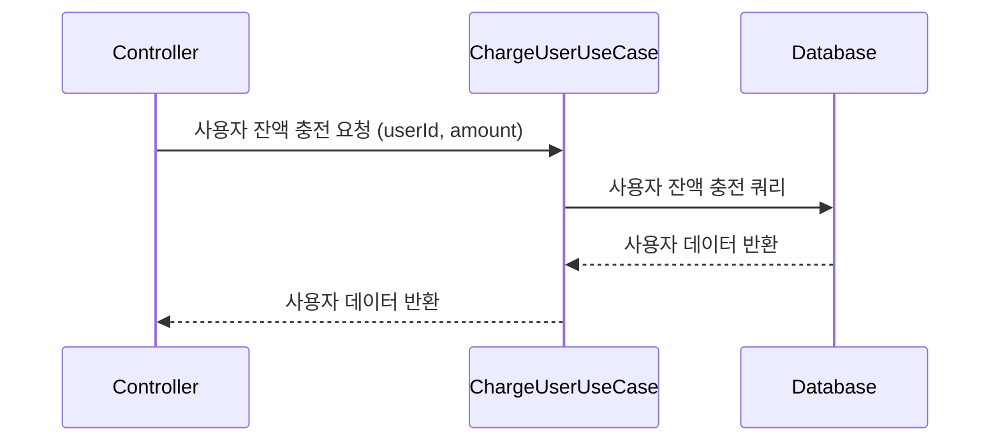

**잔액 조회 API**

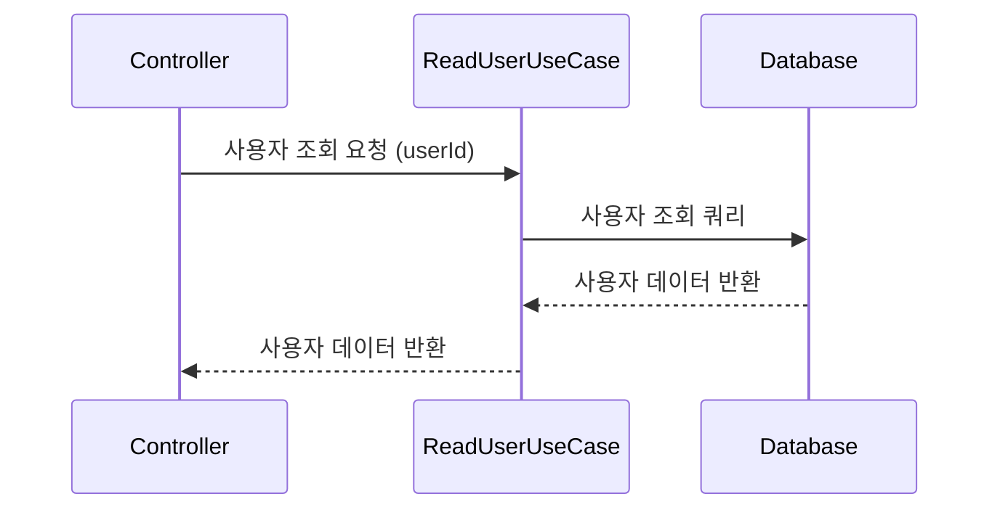

### 📱상품 조회 API

**전체 상품 조회**

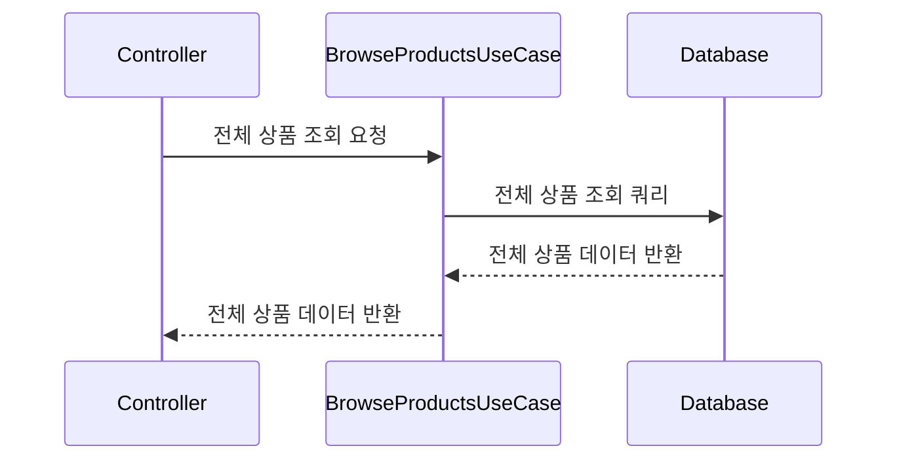

**특정 상품 조회**

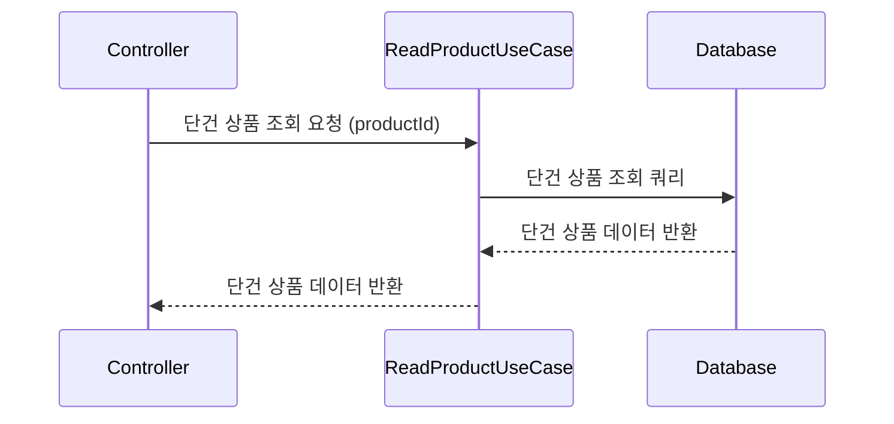

**상위 상품 조회**

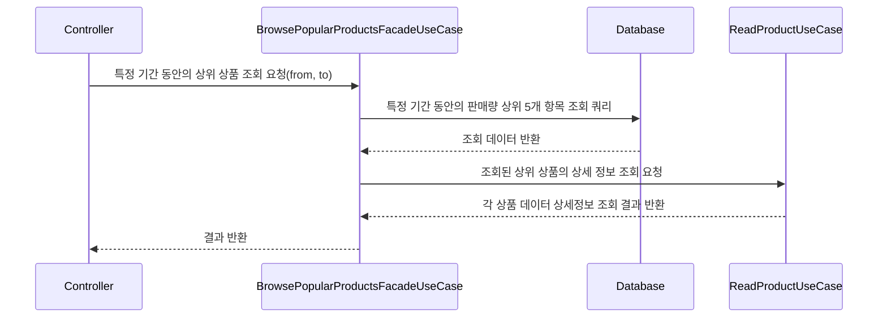

### 💸주문 / 결제 API

#### 주문 생성

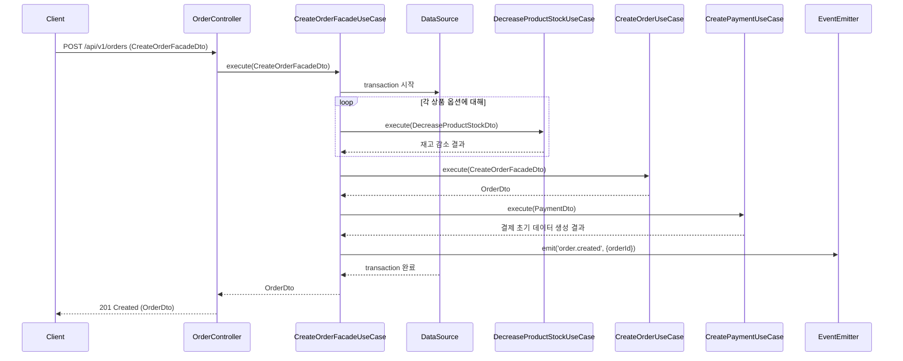

#### 결제 처리

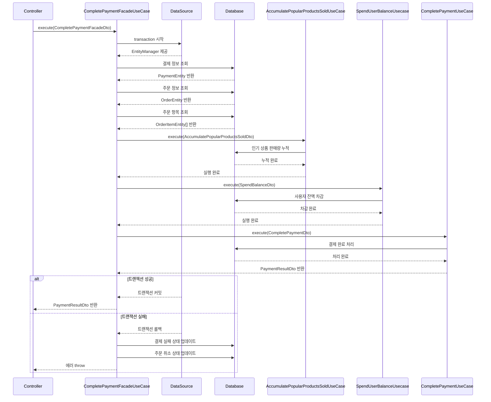

### 🛒장바구니 API

**장바구니 상품 추가 API**

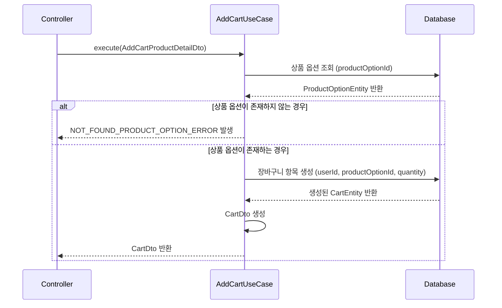

**장바구니 상품 삭제 API**

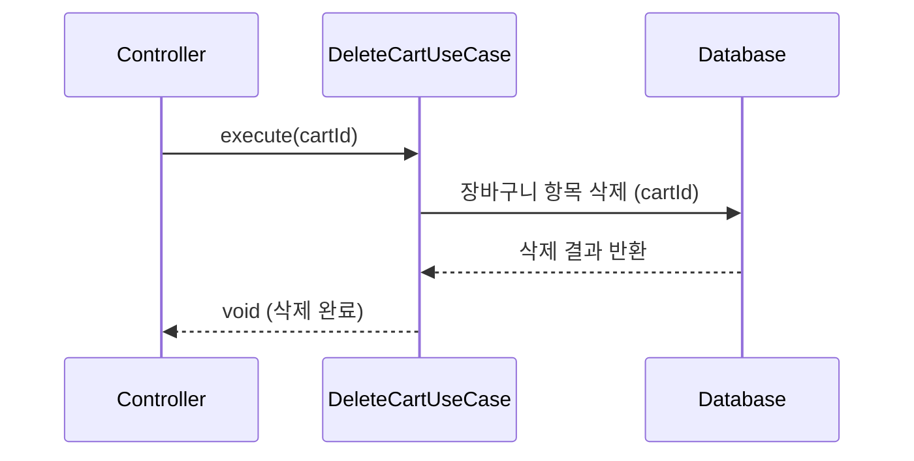

**장바구니 상품 조회 API**

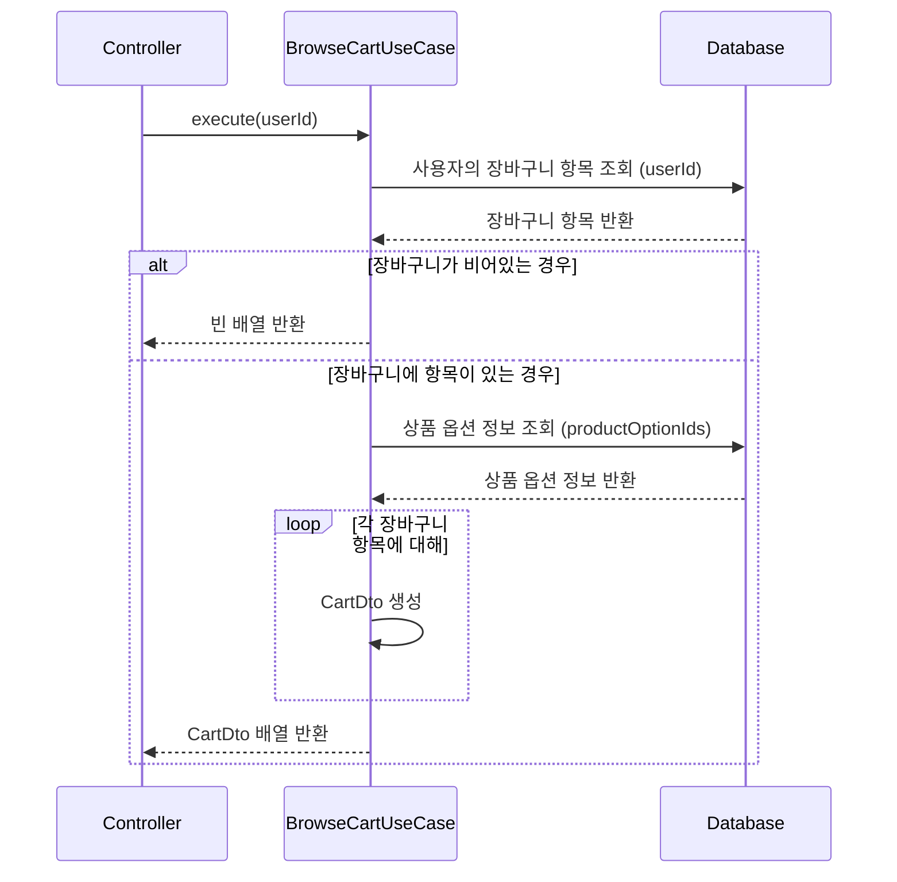

# E-commerce ERDiagram

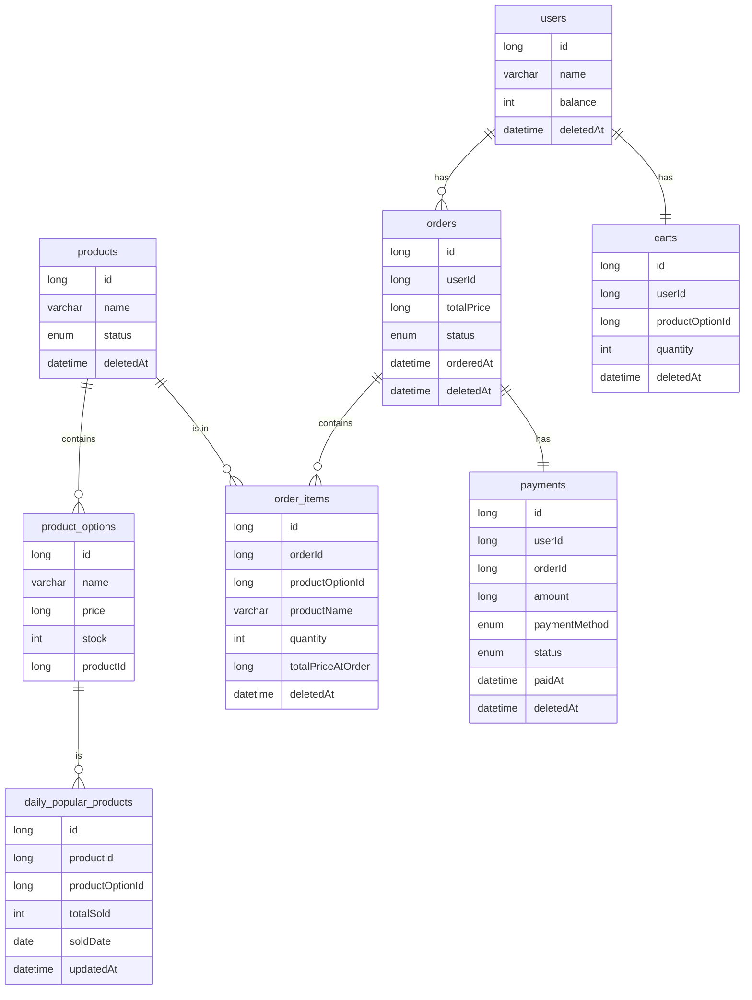
