# Milestone

# E-Commerce Sequence Diagram

### 💰잔액 API

**잔액 충전 API**

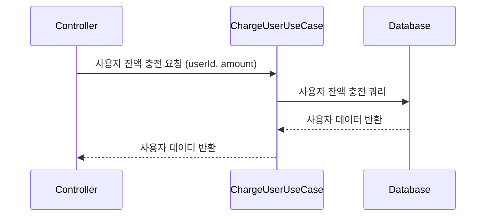

**잔액 조회 API**

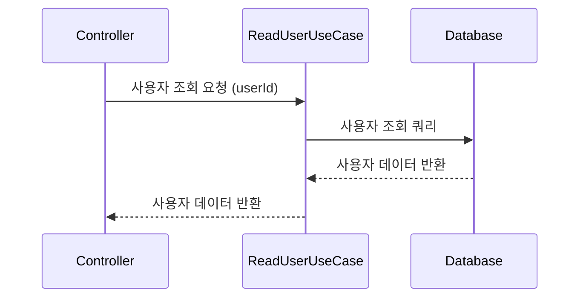

### 📱상품 조회 API

**전체 상품 조회**

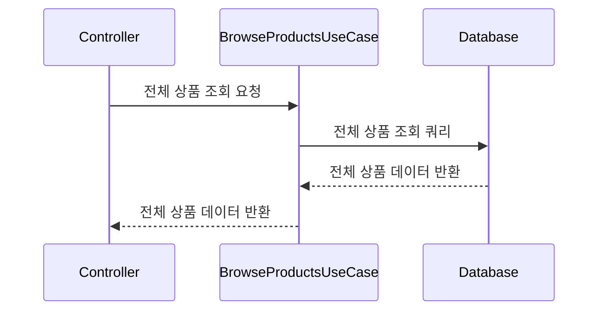

**특정 상품 조회**

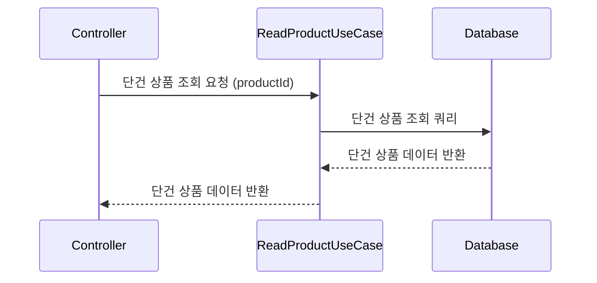

**상위 상품 조회**

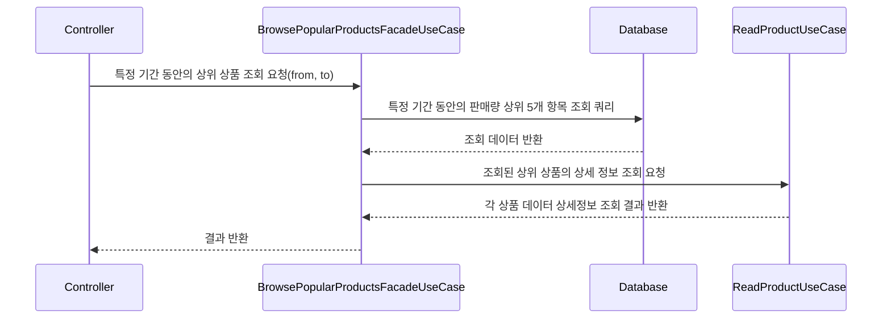

### 💸주문 / 결제 API

#### 주문 생성

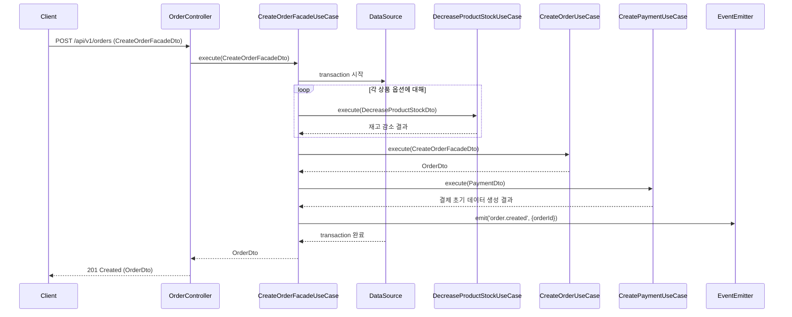

#### 결제 처리

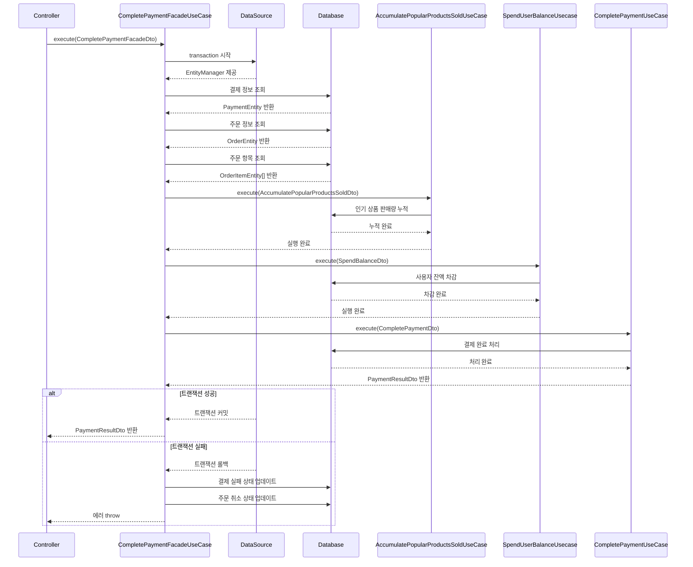

### 🛒장바구니 API

**장바구니 상품 추가 API**

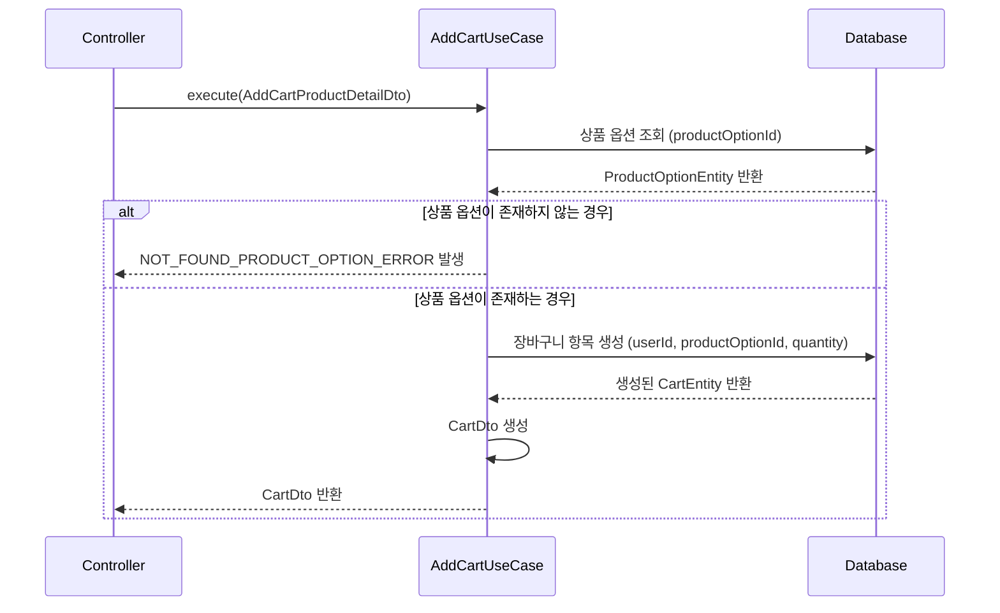

**장바구니 상품 삭제 API**

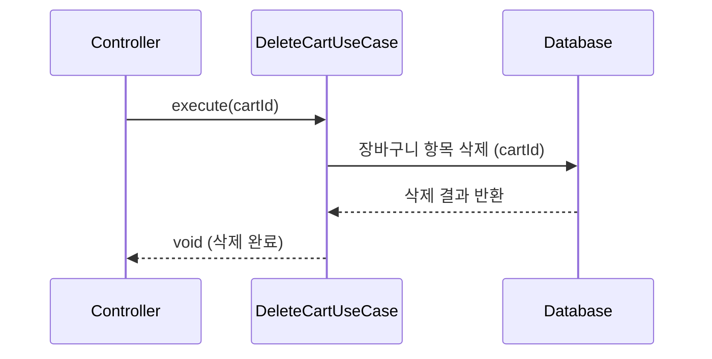

**장바구니 상품 조회 API**

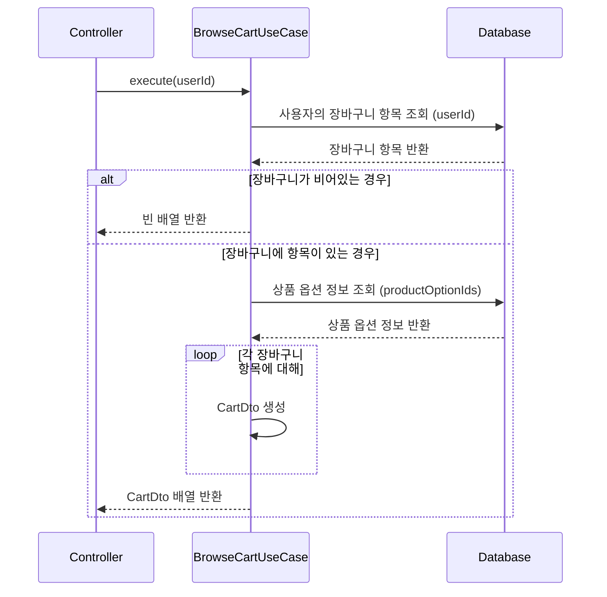

# E-commerce ERDiagram

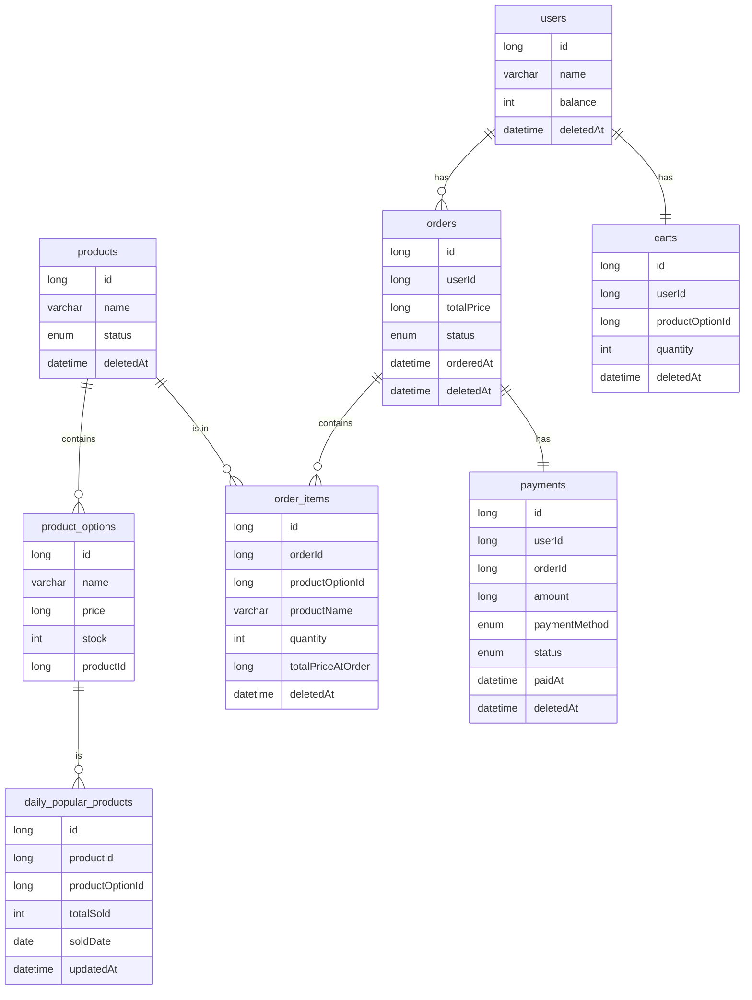

# 동시성 제어 방식에 대한 고찰

과제의 문서에서는 동시성을 제어해야하는 대상을 다음과 같이 언급하였다.

- 재고 감소
- 유저 잔액 차감

재고 감소의 경우에는 정확하게 사용자가 실제로 구매한 만큼만 차감이 이루어져야한다. 실제로는 100개가 팔렸는데 80개만 차감되어서 재고가 남아있는것으로 보여서는 안된다. 따라서 명백하게 동시성 제어의 대상이 맞다고 생각한다.

그러나 유저 잔액 차감의 경우에는 의문이든다. 우선 잔액 차감은 해당 사용자 스스로만이 접근할 수 있다. 여러 사용자가 한 사용자의 잔액을 차감하려들지는 못할 것이다.
만약 한 사용자의 잔액에 대해 동일한 금액으로 10번의 잔액 차감 요청이 들어와서, 이에 대해 모두 깔끔하게 처리해서 10번에 해당하는 금액을 모두 차감시켜주는것이 오히려 사용자에게는 당혹스러울 것이라고 생각한다. 따라서 이 경우에는 한번의 요청만 성공시키거나 모든 요청을 거부시키는 처리를 하는것이 오히려 자연스럽지 않나 싶은 생각이 들었다.

## 👕 재고 감소 동시성 제어

### 💡비관적 락 vs 낙관적 락

재고감소에 대해서 동시성 제어를 하기 위해서 초기에 비관적락을 적용하였다. 그 근거는 다음과 같다.

1. 평소에는 상품 재고 감소 로직에서 충돌이 많이 발생하지 않는다. 대부분의 경우에는 낙관적 락으로 구현해도 문제가 없으나, 타임세일과 같은 특수한 상황에서는 다량의 트랜잭션 충돌이 발생할 가능성이 존재하기 때문에 비관적 락을 사용하기로 결정하였다.
2. 충돌이 많이 발생하더라도 콘서트의 특정 좌석을 예매하는 상황 같은 요구사항이라면, 낙관적 락을 이용해 구현하는것도 괜찮다고 생각하였다. 왜냐하면 특정 한 자리에 대해서 충돌이 발생하였다는 것은 이미 그 자리는 예매가 완료되었다는 것이기 때문이다. 그러나 e커머스의 상품 재고 감소의 경우에는 특정한 옷 한 벌을 고르는 것이 아니라, 한 옵션에 해당하는 재고들 중 하나를 감소시키는 것이므로 재고가 남아있는 한 해당 옷 옵션에 들어온 요청에 대해서는 모두 처리를 성공시켜야 할 것 으로 생각하여 비관적 락을 선택하였다.

### 💡재고 감소에서 비관적 락 선택에 따른 장/단점과 성능 비교

#### 장점

- 타임 세일과 같이 트랜잭션 충돌이 많이 발생할 수 있는 환경에서 데이터 무결성을 안전하게 보장할 수 있다.
- 낙관적 락에 비해 고려해야할 부분들이 적어 구현이 상대적으로 간단하다.

#### 단점

- 트랜잭션이 데이터에 락을 잡고 있는 동안, 다른 트랜잭션은 대기해야하므로 전체 시스템 성능 저하 가능성이 존재한다.
- 데드락 가능성이 존재한다.

### 💡비관적 락 vs 낙관적 락 성능 측정

여기까지가 내가 직접 성능 측정을 하기 전까지 알고 있던 내용이다. 이 내용을 증명하기 위해서 비관적 락과 낙관적 락으로 각각 재고 감소 로직을 구현하여 성능을 측정해보았다.

#### 테스트 조건

1. 100개의 재고가 존재
2. 각 요청에서 사용자 100명이 1개씩 재고 감소 요청을 보냄
3. 테스트 결과 0개의 재고가 남아야함
   이때 낙관적 락의 경우 재시도를 50번까지 시도하도록 하였다.

#### 테스트 결과

- 비관적 락
  

- 낙관적 락
  

아무리 재시도를 하더라도 그래도 락을 잡지 않는 낙관적 락이 처리 속도에서 우위에 있을 것이라고 생각하였다. 그러나 그 결과는 예상을 빗나갔다. 낙관적 락에서 여러번의 충돌이 발생하며 성공을 보장하기위해 재시도가 반복해서 발생하였고, 이에 따라 처리 속도가 2배~3배 가량 비관적 락보다 느려지는 경우가 발생하였다.

이 비교 테스트의 결과와 타임 세일과 같은 대량 트랜잭션 충돌 상황의 특수성을 고려하였을때, 더욱 더 재고감소 로직에 비관적 락을 사용하지 않을 이유가 없어보였다.

### 💡비관적 락이면 충분할까?

비관적 락을 사용하는것이 낙관적 락에 비해서는 더 나은 선택이라는 것이 명백해졌다. 그렇다면 이렇게 검증된 비관적 락이라면 그 어떤 상황에서도 만능일까?

이를 확인해보기 위해 테스트 조건에서 트래픽을 조금 더 추가해보았다.

#### 테스트 조건

1. 1000개의 재고가 존재
2. 각 요청에서 사용자 1000명이 1개씩 재고 감소 요청을 보냄

   - 각 요청에서의 로직 처리 속도를 로깅함

3. 테스트 결과 0개의 재고가 남아야함

#### 테스트 결과

- 비관적 락
  

단 1000개의 동시 트래픽만 발생하더라도 비즈니스 로직내에서 각 쿼리 하나하나가 처리된 시간은 크게 차이가 없으나, 한 트랜잭션 전체 처리 시간은 크게 증가한것을 확인할 수 있었다. 이것은 어떤 것을 의미할까?

비관적 락의 특성상 한 트랜잭션씩 db락을 획득하게 되고, 해당 트랜잭션이 락을 해제하기 전까지 다른 트랜잭션들은 대기하게된다. 요청이 점점 늘어날수록 락 획득을 대기하는 트랜잭션은 점점 늘어나게 되고, db 커넥션 풀까지 고갈되며 전체 트랜잭션의 처리 속도가 느려지게 된다.

서비스에 100명 이하의 TPS만 발생한다는 보장이 없기 때문에 개선되어야할 부분이라고 생각한다. 이 부분은 어떻게 개선할 수 있을까? 현재 문제점을 다음과 같이 요약해볼 수 있다.

- 데이터베이스가 모든 락을 관리하고 있으며, 이 락은 트랜잭션이 시작된 후에 획득하기 때문에 한 트랜잭션이 과도하게 오래 유지되는 경우가 발생한다.

결국 이 문제를 해결하기 위해서는 락에 대한 관리를 DB가 아닌 다른 곳에서 담당하도록 해야한다. 그리고 락을 먼저 획득하고 트랜잭션을 실행하도록 해서 각 트랜잭션이 짧게 유지되어지도록 하고, 그러면서 동시에 scale out 되어있는 여러대의 서버 인스턴스에서도 락 관리가 잘 이루어져야한다.

### 💡Redis 기반의 분산 락 적용
