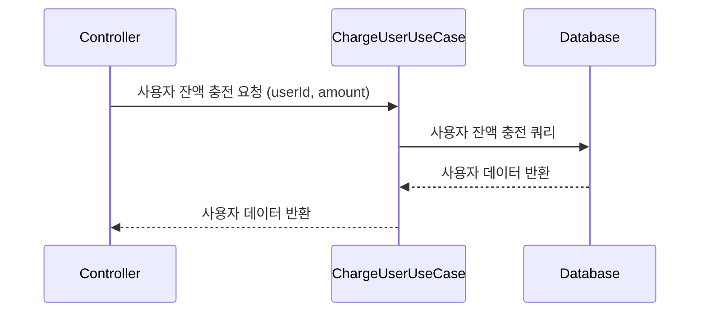
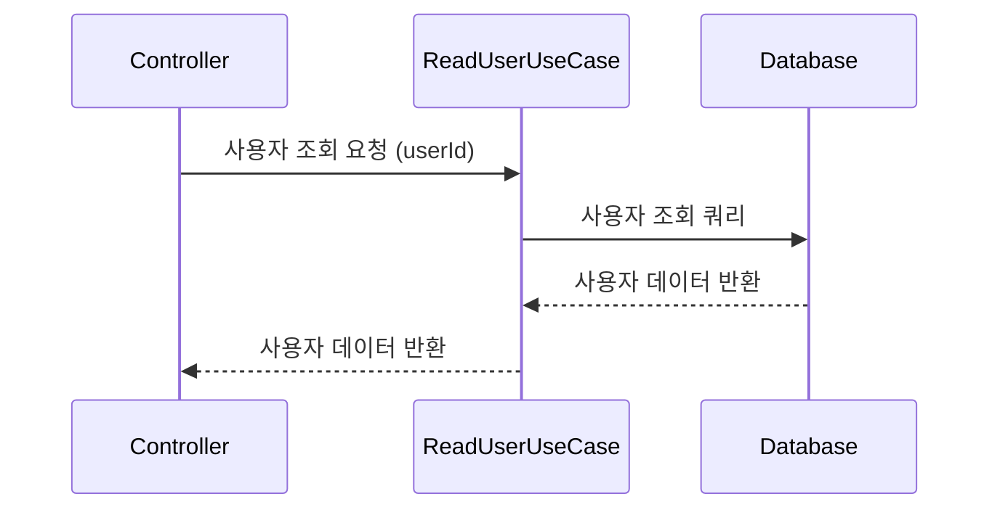
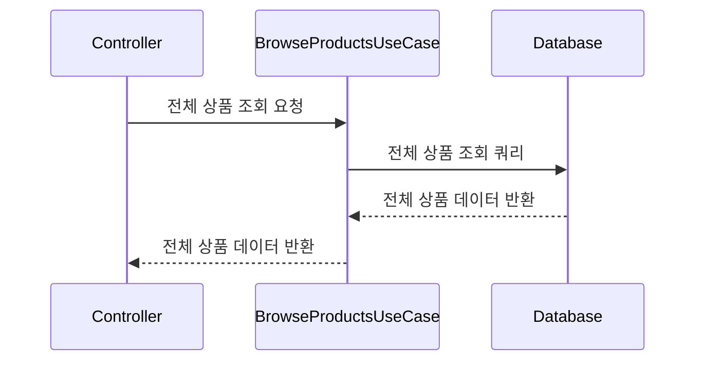
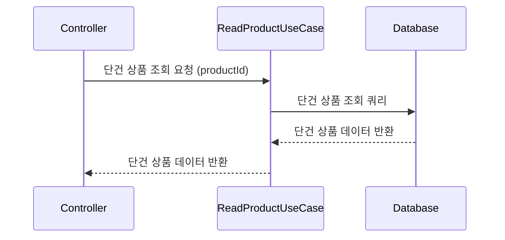
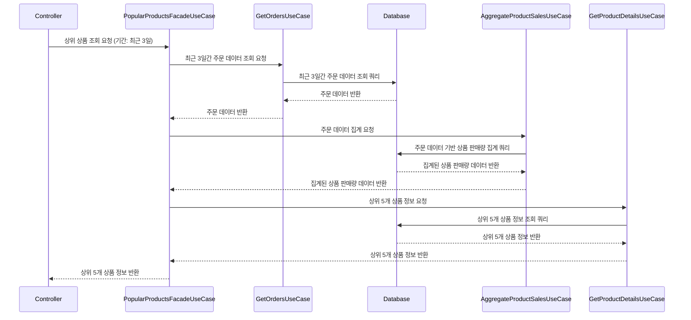
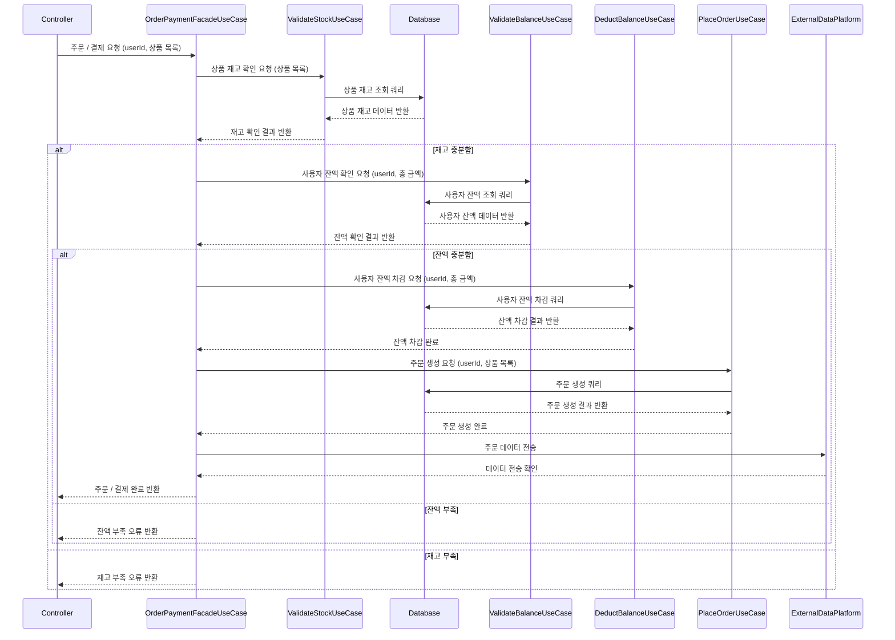
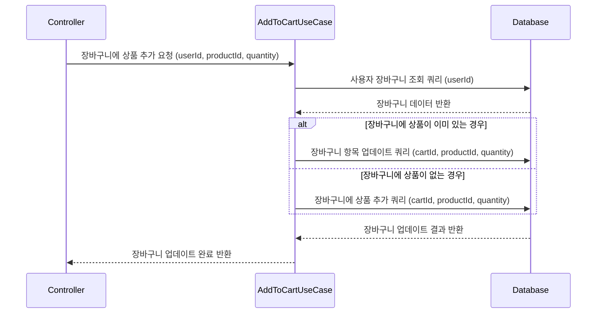
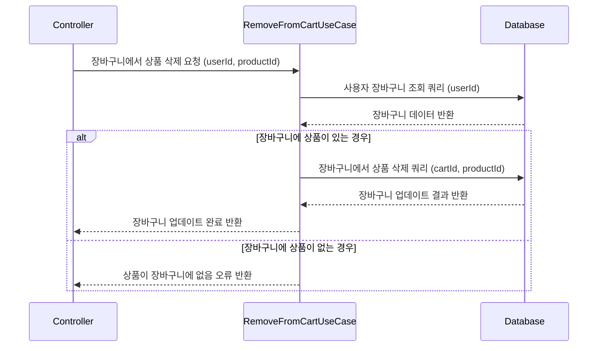
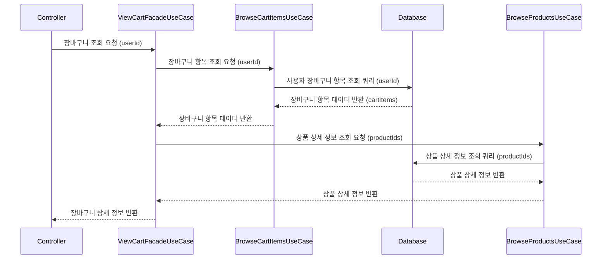

# Milestone

# E-Commerce Sequence Diagram

### 💰잔액 API

**잔액 충전 API**

**잔액 조회 API**

### 📱상품 조회 API

**전체 상품 조회**

**특정 상품 조회**

**상위 상품 조회**

### 💸주문 / 결제 API

### 🛒장바구니 API

**장바구니 상품 추가 API**

**장바구니 상품 삭제 API**

**장바구니 상품 조회 API**

