# 동시성 제어 방식에 대한 고찰

과제의 문서에서는 동시성을 제어해야하는 대상을 다음과 같이 언급하였다.

- 재고 감소
- 유저 잔액 차감

재고 감소의 경우에는 정확하게 사용자가 실제로 구매한 만큼만 차감이 이루어져야한다. 실제로는 100개가 팔렸는데 80개만 차감되어서 재고가 남아있는것으로 보여서는 안된다. 따라서 명백하게 동시성 제어의 대상이 맞다고 생각한다.

그러나 유저 잔액 차감의 경우에는 의문이든다. 우선 잔액 차감은 해당 사용자 스스로만이 접근할 수 있다. 여러 사용자가 한 사용자의 잔액을 차감하려들지는 못할 것이다.
만약 한 사용자의 잔액에 대해 동일한 금액으로 10번의 잔액 차감 요청이 들어와서, 이에 대해 모두 깔끔하게 처리해서 10번에 해당하는 금액을 모두 차감시켜주는것이 오히려 사용자에게는 당혹스러울 것이라고 생각한다. 따라서 이 경우에는 한번의 요청만 성공시키거나 모든 요청을 거부시키는 처리를 하는것이 오히려 자연스럽지 않나 싶은 생각이 들었다.

## 👕 재고 감소 동시성 제어

### 💡비관적 락 vs 낙관적 락

재고감소에 대해서 동시성 제어를 하기 위해서 초기에 비관적락을 적용하였다. 그 근거는 다음과 같다.

1. 평소에는 상품 재고 감소 로직에서 충돌이 많이 발생하지 않는다. 대부분의 경우에는 낙관적 락으로 구현해도 문제가 없으나, 타임세일과 같은 특수한 상황에서는 다량의 트랜잭션 충돌이 발생할 가능성이 존재하기 때문에 비관적 락을 사용하기로 결정하였다.
2. 충돌이 많이 발생하더라도 콘서트의 특정 좌석을 예매하는 상황 같은 요구사항이라면, 낙관적 락을 이용해 구현하는것도 괜찮다고 생각하였다. 왜냐하면 특정 한 자리에 대해서 충돌이 발생하였다는 것은 이미 그 자리는 예매가 완료되었다는 것이기 때문이다. 그러나 e커머스의 상품 재고 감소의 경우에는 특정한 옷 한 벌을 고르는 것이 아니라, 한 옵션에 해당하는 재고들 중 하나를 감소시키는 것이므로 재고가 남아있는 한 해당 옷 옵션에 들어온 요청에 대해서는 모두 처리를 성공시켜야 할 것 으로 생각하여 비관적 락을 선택하였다.

### 💡재고 감소에서 비관적 락 선택에 따른 장/단점과 성능 비교

#### 장점

- 타임 세일과 같이 트랜잭션 충돌이 많이 발생할 수 있는 환경에서 데이터 무결성을 안전하게 보장할 수 있다.
- 낙관적 락에 비해 고려해야할 부분들이 적어 구현이 상대적으로 간단하다.

#### 단점

- 트랜잭션이 데이터에 락을 잡고 있는 동안, 다른 트랜잭션은 대기해야하므로 전체 시스템 성능 저하 가능성이 존재한다.
- 데드락 가능성이 존재한다.

### 💡비관적 락 vs 낙관적 락 성능 측정

여기까지가 내가 직접 성능 측정을 하기 전까지 알고 있던 내용이다. 이 내용을 증명하기 위해서 비관적 락과 낙관적 락으로 각각 재고 감소 로직을 구현하여 성능을 측정해보았다.

#### 테스트 조건

1. 100개의 재고가 존재
2. 각 요청에서 사용자 100명이 동시에 1개의 재고 감소 요청을 보냄
3. 테스트 결과 0개의 재고가 남아야함
   이때 낙관적 락의 경우 재시도를 50번까지 시도하도록 하였다. (재고감소의 경우에는 어떻게든 성공을 시켜야하므로)

#### 테스트 결과

- 비관적 락
  

- 낙관적 락
  

아무리 재시도를 하더라도 그래도 락을 잡지 않는 낙관적 락이 처리 속도에서 우위에 있을 것이라고 생각하였다. 그러나 그 결과는 예상을 빗나갔다. 낙관적 락에서 여러번의 충돌이 발생하며 성공을 보장하기위해 재시도가 반복해서 발생하였고, 이에 따라 처리 속도가 2배~3배 가량 비관적 락보다 느려지는 경우가 발생하였다.

이 비교 테스트의 결과와 타임 세일과 같은 대량 트랜잭션 충돌 상황의 특수성을 고려하였을때, 더욱 더 재고감소 로직에 비관적 락을 사용하지 않을 이유가 없어보였다.

### 💡비관적 락이면 충분할까?

비관적 락을 사용하는것이 낙관적 락에 비해서는 더 나은 선택이라는 것이 명백해졌다. 그렇다면 이렇게 검증된 비관적 락이라면 그 어떤 상황에서도 만능일까?

이를 확인해보기 위해 테스트 조건에서 트래픽을 조금 더 추가해보았다.

#### 테스트 조건

1. 1000개의 재고가 존재
2. 각 요청에서 사용자 1000명이 동시에 1개의 재고 감소 요청을 보냄

   - 각 요청에서의 로직 처리 속도를 로깅함

3. 테스트 결과 0개의 재고가 남아야함

#### 테스트 결과

- 비관적 락
  

단 1000개의 동시 트래픽만 발생하더라도 비즈니스 로직내에서 각 쿼리 하나하나가 처리된 시간은 크게 차이가 없으나, 한 트랜잭션 전체 처리 시간은 크게 증가한것을 확인할 수 있었다. 이것은 어떤 것을 의미할까?

비관적 락의 특성상 한 트랜잭션씩 db락을 획득하게 되고, 해당 트랜잭션이 락을 해제하기 전까지 다른 트랜잭션들은 대기하게된다. 요청이 점점 늘어날수록 락 획득을 대기하는 트랜잭션은 점점 늘어나게 되고, db 커넥션 풀까지 고갈되며 전체 트랜잭션의 처리 속도가 느려지게 된다.

서비스에 100명 이하의 TPS만 발생한다는 보장이 없기 때문에 개선되어야할 부분이라고 생각한다. 이 부분은 어떻게 개선할 수 있을까? 현재 문제점을 다음과 같이 요약해볼 수 있다.

- 데이터베이스가 모든 락을 관리하고 있으며, 이 락은 트랜잭션이 시작된 후에 획득하기 때문에 한 트랜잭션이 과도하게 오래 유지되는 경우가 발생한다.

결국 이 문제를 해결하기 위해서는 락에 대한 관리를 DB가 아닌 다른 곳에서 담당하도록 해야한다. 그리고 락을 먼저 획득하고 트랜잭션을 실행하도록 해서 각 트랜잭션이 짧게 유지되어지도록 하고, 그러면서 동시에 scale out 되어있는 여러대의 서버 인스턴스에서도 락 관리가 잘 이루어져야한다.

### 💡Redis 기반의 분산 락 적용

#### Redis 기반의 분산 락을 선택한 이유

최종적으로 서버 인스턴스와 별개로 redis 서버를 배치하여, redis가 여러대의 분산된 서버 인스턴스의 락을 관리할 수 있도록 구현하였다. 그 근거는 다음과 같다.

- e커머스 프로젝트는 scale out된 서버 애플리케이션 환경을 가정한다.
- 비관적 락의 경우 요청이 많아질수록 트랜잭션을 시작한 상태에서 락을 대기하기 때문에, DB의 커넥션을 계속 차지하고 있게 된다. 이는 DB의 부하가 심해지는것을 의미하기 때문에, 이를 해소시켜줄 방법이 필요하다.
- Redis는 in-memory 기반으로 매우 빠른 요청 성능을 보여준다. 또한 싱글 스레드 기반이기 때문에 동시성 처리에 적합하다.

위와 같은 이유로 분산 락 방식을 선택하였고, 그 중에서도 Redis를 사용하여 분산 락을 구현하기로 결정하였다.

#### Spinlock vs Redlock vs Pub/Sub

**Spinlock**

- 이 방식은 단일 노드에서 가장 간단하게 구현할 수 있는 락 방식이다.
- CPU 자원을 계속해서 사용하며, 락이 해제될때 까지 무한하게 반복하며 락 획득을 대기한다.
- 장점
  - delay가 짧다 -> 빠르게 락 획득 가능
- 단점
  - CPU 집약적이기 때문에, 여러 스레드가 동시에 락 획득을 시도할 경우 심각한 성능 저하가 발생할 수 있다.
  - 일반적으로 단일 노드에서 작동하므로, 해당 단일 노드에 장애가 생겼을때 모든 락 메커니즘도 중단된다.

**Redlock**

- 분산 환경에서 신뢰할 수 있는 락을 제공하기 위해 설계된 알고리즘이다.
- 여러개의 Redis 인스턴스에서 과반수의 락을 획득하는것을 목표로 한다.
- 장점
  - 여러개의 노드를 사용하기 때문에, 한 개의 노드에 장애가 발생하더라도 다른 노드로 락 메커니즘을 유지할 수 있다.
- 단점
  - delay가 길다
  - 여러 인스턴스 간의 통신으로 인해 네트워크 비용이 발생한다.

**Pub/Sub**

- 분산 시스템에서 이벤트 기반 통신을 위해 사용되는 메커니즘이다.
- 장점/단점 (브로커의 성능에 의존함)
  - 메시지 브로커 처리 능력에 따라 실시간에 가까운 성능을 보일 수 있다.
  - 메시지 브로커의 신뢰성에 따라 메시지 손실 가능성이 존재한다.
  - 메시지 브로커 부하에 따라 자원 비용이 달라진다.

이 중에서 Redlock 방식과 Pub/Sub 방식을 사용해서 성능을 비교해보았다. 테스트 조건은 다음과 같다.

1. 1000개의 재고가 존재
2. 각 요청에서 사용자 1000명이 동시에 1개의 재고 감소 요청을 보냄
   - 각 요청에서의 로직 처리 속도를 로깅함
3. 테스트 결과 0개의 재고가 남아야함

### 분산락 방식에 따른 성능 비교

#### Redlock

- Redlock 방식 테스트 결과
  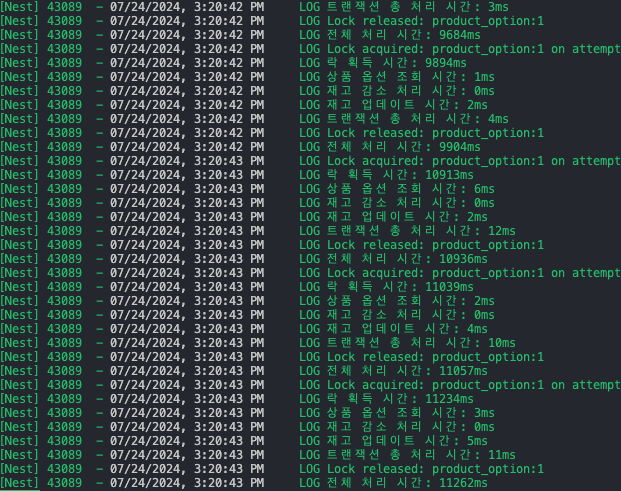

이 테스트를 진행하기 전까지는 in-memory 기반의 redis를 사용하는 분산락 방식이 한 요청의 전체 처리 시간이 비관적 락 방식보다 더 빠를 것으로 예상하였다. 그러나 그 결과는 보기 좋게 빗나갔다.

이전에 1000개의 동시 요청에 대해서 가장 마지막 요청을 6000ms대로 마무리 지었다면, 이번 Redlock 방식의 redis 분산락은 가장 마지막 요청을 11000ms 대로 마무리지었다. 무려 2배 가까이 느린 결과였다.

이 결과에 대해서 어떤 이유때문인지 고민하였고, 다음과 같이 추측해볼 수 있었다.

락을 획득해야만 트랜잭션을 시작할 수 있기 때문에, 확실하게 `트랜잭션 총 처리 시간`은 감소하였다. 그러나 전체 처리 시간은 증가했다는것으로 미루어 보았을때, 락을 획득하는 시간이 비관적 락에 비해서 더 느려진다고 생각해볼 수 있었다.
Redlock 방식에는 앞서 소개했던것처럼 네트워크 비용이 발생하며, 요청 재시도까지 딜레이가 발생한다. 만약 재시도 요청 딜레이가 400ms인데 재시도 요청을 하고 1ms 뒤에 락이 해제되었다면, 다시 락을 획득하기 위해 399ms를 기다려야함을 의미한다.

이와 같은 시간이 누적되어서 결국 트랜잭션 내에서 db의 락을 즉시 획득할때보다 많이 늦어질 수 밖에 없었을 것이다.

#### Pub/Sub

- Pub/Sub 방식 테스트 결과
  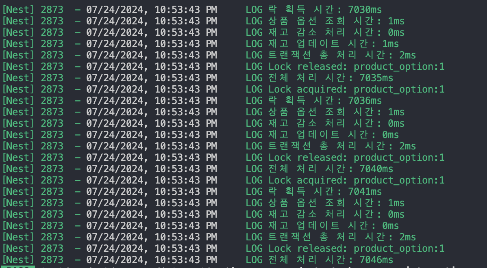

예상보다 Redlock 방식의 분산락이 성능이 너무 느렷던 탓에 조금 더 성능이 나을 것으로 예상되는 Pub/Sub 방식을 구현해보고 성능을 측정해보게 되었다.

테스트를 진행하기 전 Redlock 방식보다는 성능에서 확실히 우위에 있을 것이라고 예상하였고, 역시나 11000ms대로 마지막 요청을 처리했던 비관적 락에 비해 더 빠른 7000ms로 마지막 요청을 처리하며 더 나은 처리 속도를 보였다.

이는 6000ms였던 비관적 락과 비교해보았을 때 큰 차이가 나지 않는 속도였다. 그렇다면 이 1000ms의 시간차는 어떤 부분에서 발생한 것일까? 실시간에 거의 가까운 pub/sub 방식이라는 점을 미루어 보았을때, 이 시간 차이는 네트워크 비용에 의해 발생한 시간이라는 것을 알 수 있었다.

우선 이 프로젝트에서는 성능을 가장 최우선으로 고려하여, 성능이 뛰어난 Pub/Sub 방식을 채택하기로 하였다.

그러나 이 방식이 속도가 빠르다고해서 만능인것은 아니다. 이 방식 역시 많은 양의 요청이 발생하면 그 만큼 redis에 병목이 발생하게 되고, 이 과정에서 유실되는 메시지가 발생할 가능성이 생긴다. 이에 따라 추가적인 메시지 브로커를 도입하여 가용성과 확장성을 보장할 수 있을 것이다.

### 결론

이번 주차를 수행하며, 요구사항에 따라 어떤 락이 적절한지 판단할 수 있는 능력이 조금이나마 길러진 것 같다. 또한 이 과정에서 직접 모든 케이스들을 구현해보며, 예상과는 달랐던 부분들에 대해서도 직접 증명해가는 과정에서 많은 것들을 배울 수 있었다.

어떠한 기술적 선택에는 충분한 고민과 근거가 필요하며, 근거를 뒷 받침하기 위해서 어설픈 추측보다는 확실한 증명이 필요하다는 것을 알 수 있었던 한 주 였다.

# Milestone

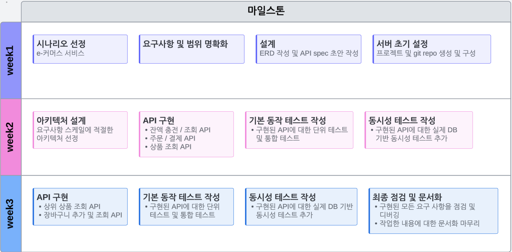

# E-Commerce Sequence Diagram

### 💰잔액 API

**잔액 충전 API**

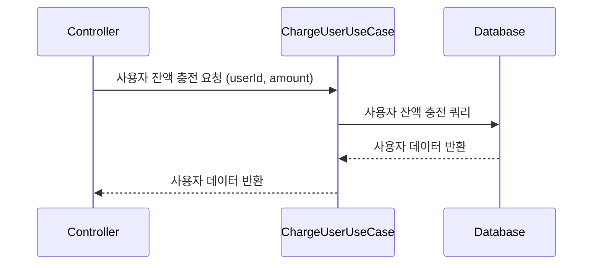

**잔액 조회 API**

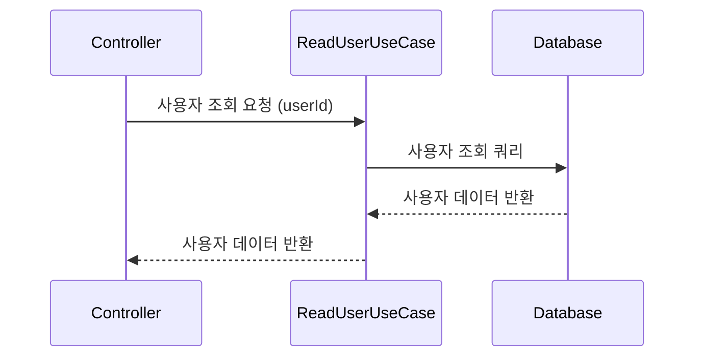

### 📱상품 조회 API

**전체 상품 조회**

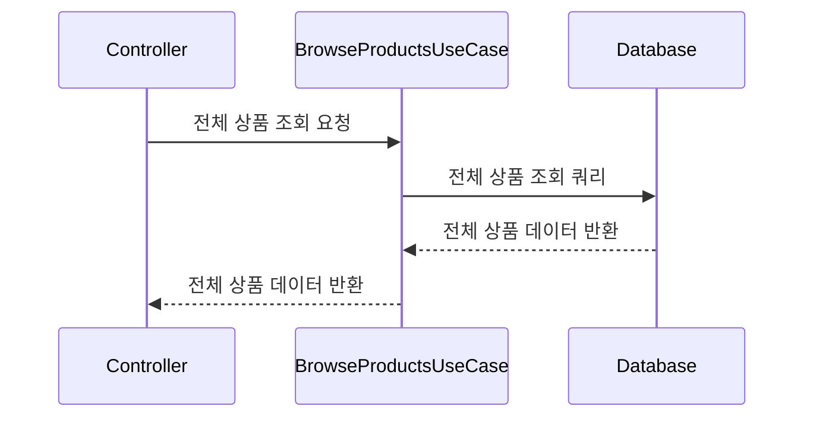

**특정 상품 조회**

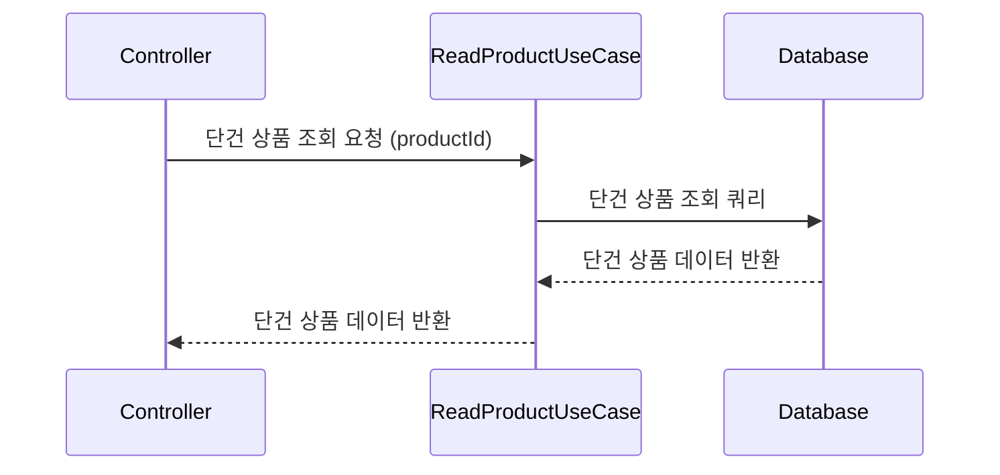

**상위 상품 조회**

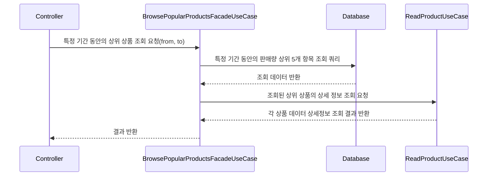

### 💸주문 / 결제 API

#### 주문 생성

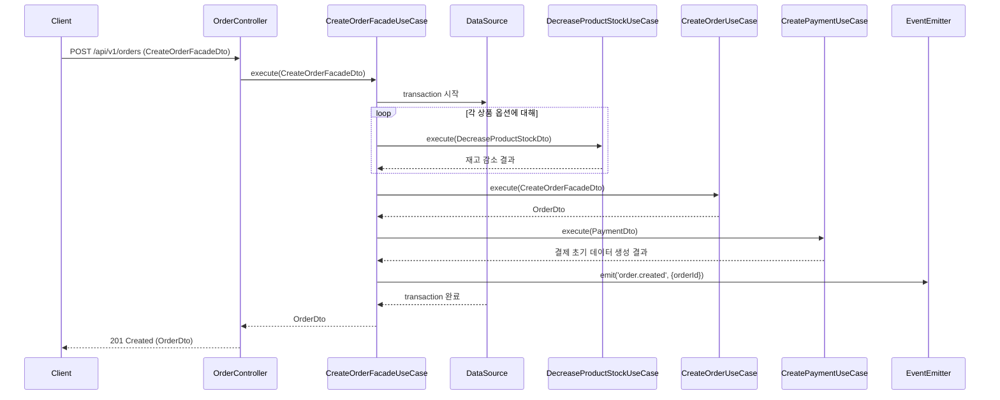

#### 결제 처리

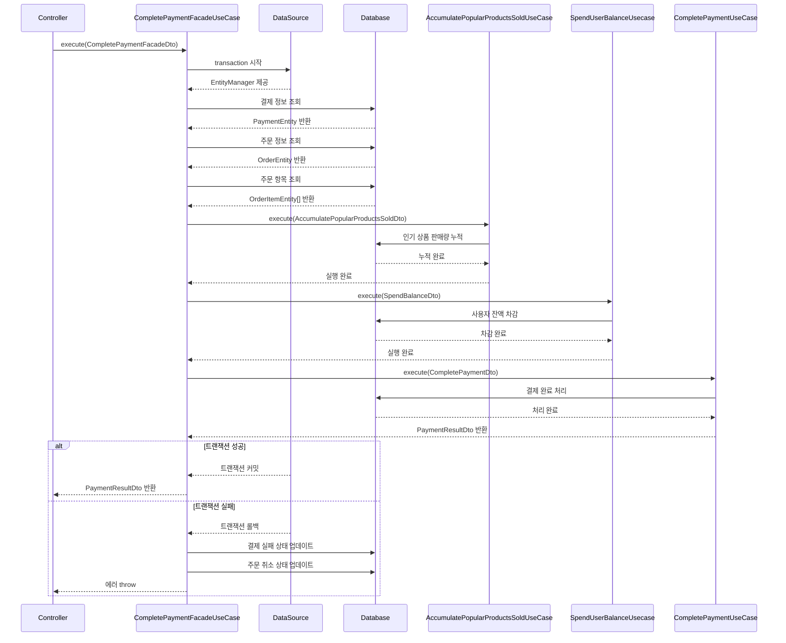

### 🛒장바구니 API

**장바구니 상품 추가 API**

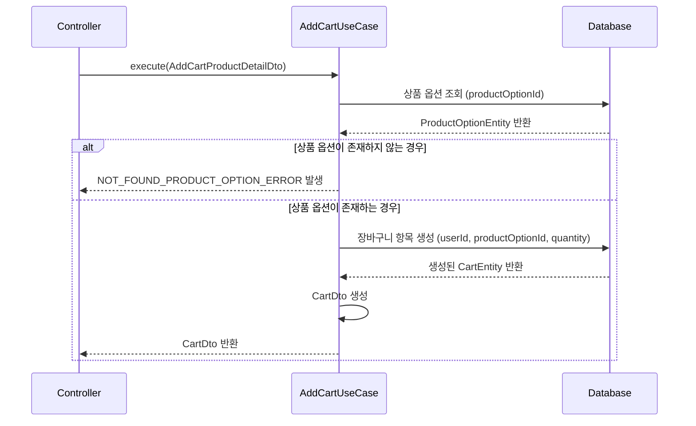

**장바구니 상품 삭제 API**

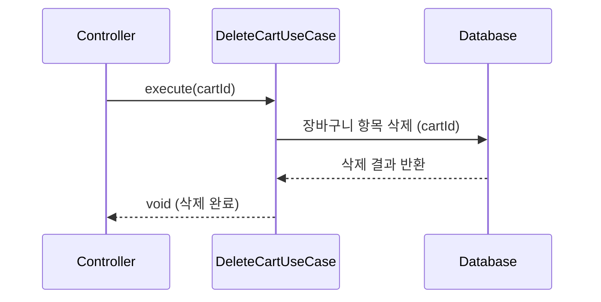

**장바구니 상품 조회 API**

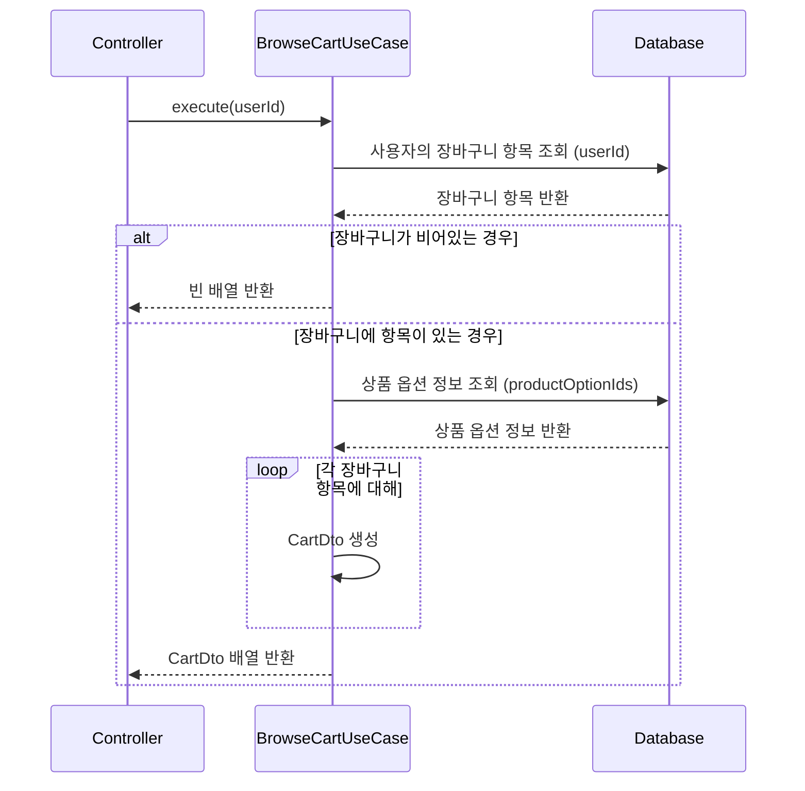

# E-commerce ERDiagram

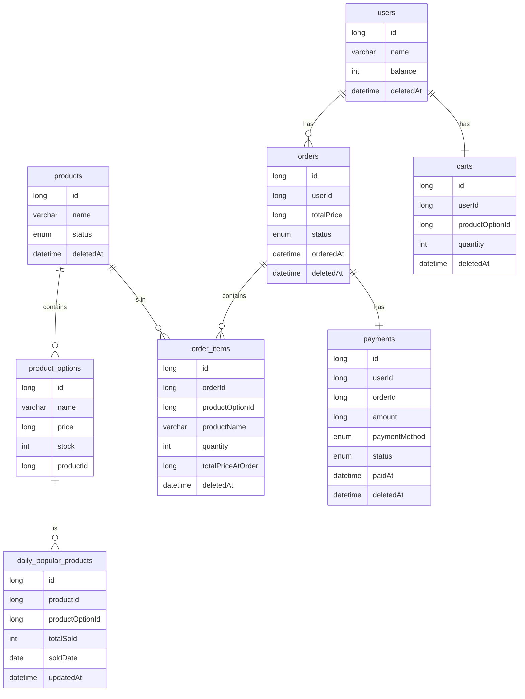
