# Milestone

# E-Commerce Sequence Diagram

### 💰잔액 API

**잔액 충전 API**

```mermaid
sequenceDiagram
  Controller ->> ChargeUserUseCase: 사용자 잔액 충전 요청 (userId, amount)
  ChargeUserUseCase ->> Database: 사용자 잔액 충전 쿼리
  Database -->> ChargeUserUseCase: 사용자 데이터 반환
  ChargeUserUseCase -->> Controller: 사용자 데이터 반환
```

**잔액 조회 API**

```mermaid
sequenceDiagram
  Controller ->> ReadUserUseCase: 사용자 조회 요청 (userId)
  ReadUserUseCase ->> Database: 사용자 조회 쿼리
  Database -->> ReadUserUseCase: 사용자 데이터 반환
  ReadUserUseCase -->> Controller: 사용자 데이터 반환
```

### 📱상품 조회 API

**전체 상품 조회**

```mermaid
sequenceDiagram
  Controller ->> BrowseProductsUseCase: 전체 상품 조회 요청
  BrowseProductsUseCase ->> Database: 전체 상품 조회 쿼리
  Database -->> BrowseProductsUseCase: 전체 상품 데이터 반환
  BrowseProductsUseCase -->> Controller: 전체 상품 데이터 반환
```

**특정 상품 조회**

```mermaid
sequenceDiagram
  Controller ->> ReadProductUseCase: 단건 상품 조회 요청 (productId)
  ReadProductUseCase ->> Database: 단건 상품 조회 쿼리
  Database -->> ReadProductUseCase: 단건 상품 데이터 반환
  ReadProductUseCase -->> Controller: 단건 상품 데이터 반환
```

**상위 상품 조회**

```mermaid
sequenceDiagram
  Controller ->> PopularProductsFacadeUseCase: 상위 상품 조회 요청 (기간: 최근 3일)
  PopularProductsFacadeUseCase ->> GetOrdersUseCase: 최근 3일간 주문 데이터 조회 요청
  GetOrdersUseCase ->> Database: 최근 3일간 주문 데이터 조회 쿼리
  Database -->> GetOrdersUseCase: 주문 데이터 반환
  GetOrdersUseCase -->> PopularProductsFacadeUseCase: 주문 데이터 반환

  PopularProductsFacadeUseCase ->> AggregateProductSalesUseCase: 주문 데이터 집계 요청
  AggregateProductSalesUseCase ->> Database: 주문 데이터 기반 상품 판매량 집계 쿼리
  Database -->> AggregateProductSalesUseCase: 집계된 상품 판매량 데이터 반환
  AggregateProductSalesUseCase -->> PopularProductsFacadeUseCase: 집계된 상품 판매량 데이터 반환

  PopularProductsFacadeUseCase ->> GetProductDetailsUseCase: 상위 5개 상품 정보 요청
  GetProductDetailsUseCase ->> Database: 상위 5개 상품 정보 조회 쿼리
  Database -->> GetProductDetailsUseCase: 상위 5개 상품 정보 반환
  GetProductDetailsUseCase -->> PopularProductsFacadeUseCase: 상위 5개 상품 정보 반환

  PopularProductsFacadeUseCase -->> Controller: 상위 5개 상품 정보 반환
```

### 💸주문 / 결제 API

#### 주문 생성

```mermaid
sequenceDiagram
  Client ->> OrderController: POST /api/v1/orders (OrderDto)
  OrderController ->> CreateOrderUseCase: 주문 생성 요청
  CreateOrderUseCase ->> ValidateStockUseCase: 상품 재고 확인 요청
  ValidateStockUseCase ->> Database: 상품 재고 조회 쿼리
  Database -->> ValidateStockUseCase: 상품 재고 데이터 반환
  ValidateStockUseCase -->> CreateOrderUseCase: 재고 확인 결과 반환
  alt 재고 충분함
    CreateOrderUseCase ->> Database: 주문 생성 쿼리
    Database -->> CreateOrderUseCase: 주문 생성 결과 반환
    CreateOrderUseCase -->> OrderController: OrderResultDto 반환
    OrderController -->> Client: 201 Created (OrderResultDto)
  else 재고 부족
    CreateOrderUseCase -->> OrderController: 재고 부족 오류
    OrderController -->> Client: 400 Bad Request (재고 부족 오류)
  end
```

#### 결제 처리

```mermaid
sequenceDiagram
  Contoller ->> ProcessPaymentFacadeUseCase: 결제 처리 요청
  ProcessPaymentFacadeUseCase ->> ValidateOrderUseCase: 주문 유효성 확인 요청
  ValidateOrderUseCase ->> Database: 주문 정보 조회 쿼리
  Database -->> ValidateOrderUseCase: 주문 정보 반환
  ValidateOrderUseCase -->> ProcessPaymentFacadeUseCase: 주문 유효성 확인 결과
  alt 주문 유효함
    ProcessPaymentFacadeUseCase ->> ValidateBalanceUseCase: 사용자 잔액 확인 요청
    ValidateBalanceUseCase ->> Database: 사용자 잔액 조회 쿼리
    Database -->> ValidateBalanceUseCase: 사용자 잔액 데이터 반환
    ValidateBalanceUseCase -->> ProcessPaymentFacadeUseCase: 잔액 확인 결과 반환
    alt 잔액 충분함
      ProcessPaymentFacadeUseCase ->> DeductBalanceUseCase: 사용자 잔액 차감 요청
      DeductBalanceUseCase ->> Database: 사용자 잔액 차감 쿼리
      Database -->> DeductBalanceUseCase: 잔액 차감 결과 반환
      DeductBalanceUseCase -->> ProcessPaymentFacadeUseCase: 잔액 차감 완료
      ProcessPaymentFacadeUseCase ->> Database: 결제 정보 저장 쿼리
      Database -->> ProcessPaymentFacadeUseCase: 결제 정보 저장 결과
      ProcessPaymentFacadeUseCase ->> UpdateOrderStatusUseCase: 주문 상태 업데이트 요청
      UpdateOrderStatusUseCase ->> Database: 주문 상태 업데이트 쿼리
      Database -->> UpdateOrderStatusUseCase: 주문 상태 업데이트 결과
      UpdateOrderStatusUseCase -->> ProcessPaymentFacadeUseCase: 주문 상태 업데이트 완료
      ProcessPaymentFacadeUseCase -->> Contoller: PaymentResultDto 반환
    else 잔액 부족
      ProcessPaymentFacadeUseCase -->> Contoller: 잔액 부족 오류
    end
  else 주문 유효하지 않음
    ProcessPaymentFacadeUseCase -->> Contoller: 유효하지 않은 주문 오류
  end
```

### 🛒장바구니 API

**장바구니 상품 추가 API**

```mermaid
sequenceDiagram
  Controller ->> AddToCartUseCase: 장바구니에 상품 추가 요청 (userId, productId, quantity)
  AddToCartUseCase ->> Database: 사용자 장바구니 조회 쿼리 (userId)
  Database -->> AddToCartUseCase: 장바구니 데이터 반환
  alt 장바구니에 상품이 이미 있는 경우
    AddToCartUseCase ->> Database: 장바구니 항목 업데이트 쿼리 (cartId, productId, quantity)
  else 장바구니에 상품이 없는 경우
    AddToCartUseCase ->> Database: 장바구니에 상품 추가 쿼리 (cartId, productId, quantity)
  end
  Database -->> AddToCartUseCase: 장바구니 업데이트 결과 반환
  AddToCartUseCase -->> Controller: 장바구니 업데이트 완료 반환

```

**장바구니 상품 삭제 API**

```mermaid
sequenceDiagram
  Controller ->> RemoveFromCartUseCase: 장바구니에서 상품 삭제 요청 (userId, productId)
  RemoveFromCartUseCase ->> Database: 사용자 장바구니 조회 쿼리 (userId)
  Database -->> RemoveFromCartUseCase: 장바구니 데이터 반환
  alt 장바구니에 상품이 있는 경우
    RemoveFromCartUseCase ->> Database: 장바구니에서 상품 삭제 쿼리 (cartId, productId)
    Database -->> RemoveFromCartUseCase: 장바구니 업데이트 결과 반환
    RemoveFromCartUseCase -->> Controller: 장바구니 업데이트 완료 반환
  else 장바구니에 상품이 없는 경우
    RemoveFromCartUseCase -->> Controller: 상품이 장바구니에 없음 오류 반환
  end
```

**장바구니 상품 조회 API**

```mermaid
sequenceDiagram
  Controller ->> ViewCartFacadeUseCase: 장바구니 조회 요청 (userId)
  ViewCartFacadeUseCase ->> BrowseCartItemsUseCase: 장바구니 항목 조회 요청 (userId)
  BrowseCartItemsUseCase ->> Database: 사용자 장바구니 항목 조회 쿼리 (userId)
  Database -->> BrowseCartItemsUseCase: 장바구니 항목 데이터 반환 (cartItems)
  BrowseCartItemsUseCase -->> ViewCartFacadeUseCase: 장바구니 항목 데이터 반환

  ViewCartFacadeUseCase ->> BrowseProductsUseCase: 상품 상세 정보 조회 요청 (productIds)
  BrowseProductsUseCase ->> Database: 상품 상세 정보 조회 쿼리 (productIds)
  Database -->> BrowseProductsUseCase: 상품 상세 정보 반환
  BrowseProductsUseCase -->> ViewCartFacadeUseCase: 상품 상세 정보 반환

  ViewCartFacadeUseCase -->> Controller: 장바구니 상세 정보 반환
```

# E-commerce ERDiagram

