# Milestone

# E-Commerce Sequence Diagram

### 💰잔액 API

**잔액 충전 API**

```mermaid
sequenceDiagram
  Controller ->> ChargeUserUseCase: 사용자 잔액 충전 요청 (userId, amount)
  ChargeUserUseCase ->> Database: 사용자 잔액 충전 쿼리
  Database -->> ChargeUserUseCase: 사용자 데이터 반환
  ChargeUserUseCase -->> Controller: 사용자 데이터 반환
```

**잔액 조회 API**

```mermaid
sequenceDiagram
  Controller ->> ReadUserUseCase: 사용자 조회 요청 (userId)
  ReadUserUseCase ->> Database: 사용자 조회 쿼리
  Database -->> ReadUserUseCase: 사용자 데이터 반환
  ReadUserUseCase -->> Controller: 사용자 데이터 반환
```

### 📱상품 조회 API

**전체 상품 조회**

```mermaid
sequenceDiagram
  Controller ->> BrowseProductsUseCase: 전체 상품 조회 요청
  BrowseProductsUseCase ->> Database: 전체 상품 조회 쿼리
  Database -->> BrowseProductsUseCase: 전체 상품 데이터 반환
  BrowseProductsUseCase -->> Controller: 전체 상품 데이터 반환
```

**특정 상품 조회**

```mermaid
sequenceDiagram
  Controller ->> ReadProductUseCase: 단건 상품 조회 요청 (productId)
  ReadProductUseCase ->> Database: 단건 상품 조회 쿼리
  Database -->> ReadProductUseCase: 단건 상품 데이터 반환
  ReadProductUseCase -->> Controller: 단건 상품 데이터 반환
```

**상위 상품 조회**

```mermaid
sequenceDiagram
  Controller ->> BrowsePopularProductsFacadeUseCase: 특정 기간 동안의 상위 상품 조회 요청(from, to)
  BrowsePopularProductsFacadeUseCase ->> Database: 특정 기간 동안의 판매량 상위 5개 항목 조회 쿼리
  Database -->> BrowsePopularProductsFacadeUseCase: 조회 데이터 반환
  BrowsePopularProductsFacadeUseCase ->> ReadProductUseCase: 조회된 상위 상품의 상세 정보 조회 요청
  ReadProductUseCase -->> BrowsePopularProductsFacadeUseCase: 각 상품 데이터 상세정보 조회 결과 반환
  BrowsePopularProductsFacadeUseCase -->> Controller: 결과 반환
```

### 💸주문 / 결제 API

#### 주문 생성

```mermaid
sequenceDiagram
    Client->>OrderController: POST /api/v1/orders (CreateOrderFacadeDto)
    OrderController->>CreateOrderFacadeUseCase: execute(CreateOrderFacadeDto)
    CreateOrderFacadeUseCase->>DataSource: transaction 시작
    loop 각 상품 옵션에 대해
        CreateOrderFacadeUseCase->>DecreaseProductStockUseCase: execute(DecreaseProductStockDto)
        DecreaseProductStockUseCase-->>CreateOrderFacadeUseCase: 재고 감소 결과
    end
    CreateOrderFacadeUseCase->>CreateOrderUseCase: execute(CreateOrderFacadeDto)
    CreateOrderUseCase-->>CreateOrderFacadeUseCase: OrderDto
    CreateOrderFacadeUseCase->>CreatePaymentUseCase: execute(PaymentDto)
    CreatePaymentUseCase-->>CreateOrderFacadeUseCase: 결제 초기 데이터 생성 결과
    CreateOrderFacadeUseCase->>EventEmitter: emit('order.created', {orderId})
    DataSource-->>CreateOrderFacadeUseCase: transaction 완료
    CreateOrderFacadeUseCase-->>OrderController: OrderDto
    OrderController-->>Client: 201 Created (OrderDto)
```

#### 결제 처리

### 🛒장바구니 API

**장바구니 상품 추가 API**

```mermaid
sequenceDiagram
    Controller->>AddCartUseCase: execute(AddCartProductDetailDto)
    AddCartUseCase->>Database: 상품 옵션 조회 (productOptionId)
    Database-->>AddCartUseCase: ProductOptionEntity 반환
    alt 상품 옵션이 존재하지 않는 경우
        AddCartUseCase-->>Controller: NOT_FOUND_PRODUCT_OPTION_ERROR 발생
    else 상품 옵션이 존재하는 경우
        AddCartUseCase->>Database: 장바구니 항목 생성 (userId, productOptionId, quantity)
        Database-->>AddCartUseCase: 생성된 CartEntity 반환
        AddCartUseCase->>AddCartUseCase: CartDto 생성
        AddCartUseCase-->>Controller: CartDto 반환
    end
```

**장바구니 상품 삭제 API**

```mermaid
sequenceDiagram
    Controller->>DeleteCartUseCase: execute(cartId)
    DeleteCartUseCase->>Database: 장바구니 항목 삭제 (cartId)
    Database-->>DeleteCartUseCase: 삭제 결과 반환
    DeleteCartUseCase-->>Controller: void (삭제 완료)
```

**장바구니 상품 조회 API**

```mermaid
sequenceDiagram
    Controller->>BrowseCartUseCase: execute(userId)
    BrowseCartUseCase->>Database: 사용자의 장바구니 항목 조회 (userId)
    Database-->>BrowseCartUseCase: 장바구니 항목 반환
    alt 장바구니가 비어있는 경우
        BrowseCartUseCase-->>Controller: 빈 배열 반환
    else 장바구니에 항목이 있는 경우
        BrowseCartUseCase->>Database: 상품 옵션 정보 조회 (productOptionIds)
        Database-->>BrowseCartUseCase: 상품 옵션 정보 반환
        loop 각 장바구니 항목에 대해
            BrowseCartUseCase->>BrowseCartUseCase: CartDto 생성
        end
        BrowseCartUseCase-->>Controller: CartDto 배열 반환
    end
```

# E-commerce ERDiagram

